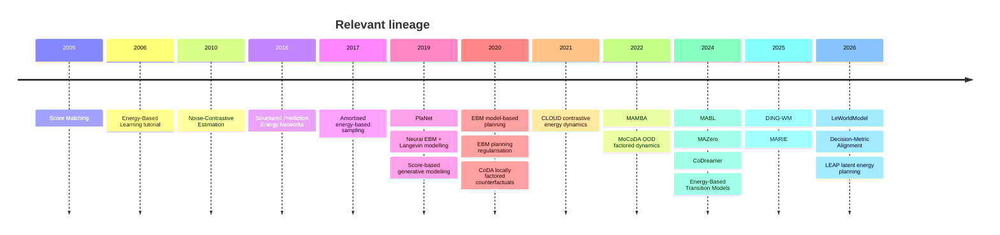

# Energy-Based Relational World Models for Counterfactual Multi-Agent Planning

## Executive summary

**Yes: energy-based models are promising for this project, but I would not replace the current relational predictor with a fully sampled EBM immediately.** The strongest first use of an EBM is as a **conditional interaction/transition energy** that learns whether a proposed latent transition is compatible with a particular joint action. This directly targets the part of the problem where your current experiments already show a signal: on Buzz Wire, the relational model captures substantially more of the true cross-agent intervention effect than independent or monolithic joint baselines, particularly under restricted/correlated joint-action coverage.

The literature gives three pieces that fit together unusually well:

$$
\boxed{
\text{local/factored dynamics}
}
$$

can generalise compositionally to unseen state/action combinations, as formalised by CoDA/MoCoDA;

$$
\boxed{
\text{energy-based transition models}
}
$$

can represent transition compatibility more flexibly than smooth feed-forward regression and have shown advantages on discontinuous and out-of-distribution transitions;

and

$$
\boxed{
\text{decision-relevant model quality}
\neq
\text{ordinary prediction quality}.
}
$$

Recent decision-metric work explicitly shows that latent prediction/decodability does not guarantee correct plan ordering under CEM.

That combination leads to a much sharper research hypothesis than simply “use EBMs in a multi-agent world model”:

> **Can a relational energy model learn the compatibility of agent–agent interaction effects under unseen joint-action compositions, and does that improve counterfactual transition fidelity and plan ranking beyond deterministic relational prediction?**

This is a credible gap. In the primary literature reviewed here, I found work on **energy-based dynamics**, work on **factored/counterfactual dynamics**, work on **multi-agent world models**, and work on **latent MPC**, but not an established method combining all four as:

$$
\boxed{
\text{conditional transition energy}
+
\text{relational MA factorisation}
+
\text{counterfactual joint-action evaluation}
+
\text{centralised MPC}.
}
$$

I would therefore **position the EBM as a hypothesis about transition representation**, not as the paper's entire identity.

The recommended sequence is:

| Priority | Experiment | Reason |
|---|---|---|
| **First** | Relational deterministic predictor **+ contrastive energy head on latent/state delta** | Almost no extra MPC cost; tests whether energy contains useful counterfactual information |
| **Second** | Joint-energy vs factorised pairwise-energy | Tests whether the benefit comes specifically from relational factorisation |
| **Third** | Use energy to **refine or reject** predicted transitions and re-run plan ranking | Directly tests whether EBM information reaches the current failure point |
| **Only if these succeed** | Full conditional EBM with predictor-initialised Langevin sampling | Much more expensive and introduces MCMC as another possible failure mode |
| **Later** | Amortised sampler | Relevant only if full EBM sampling demonstrably helps but is too slow |

This ordering matters because your present experiments already show that **the transition model is not always the bottleneck**. Transport loses useful ordering mainly during autoregressive learned rollouts, while Buzz Wire's original reward-based ranking could not work because the reward-relevant ball state was absent from the model observations. An EBM cannot recover information that is not observable, and expensive EBM sampling will not repair an unsuitable planning objective.

There is also a second reason not to jump immediately to a full EBM: **VMAS physics is largely deterministic**. In an exactly deterministic fully observed environment,

$$
p(x_{t+1}\mid x_t,a_t)
$$

is close to a point mass. A deterministic predictor is statistically well matched to that setting. The EBM becomes interesting not because VMAS requires multimodal future generation, but because **contact boundaries, restricted action coverage, latent uncertainty and unseen compositions create a difficult compatibility/generalisation problem**. ETM's reported advantage on discontinuous and OOD transitions is therefore far more relevant to this project than generic claims about EBMs being better generative models.

My recommended core model is consequently:

$$
\mu_\theta(Z_t,A_t)
=
\text{RelationalPredictor}(Z_t,A_t),
$$

together with

$$
E_\psi(
\Delta Z;
Z_t,A_t
)
$$

trained so that the **true transition has low energy** and action-mismatched, counterfactual-mismatched and predictor-generated transitions have high energy.

Then the scientific question becomes:

$$
\boxed{
\text{Does explicit relational energy improve}
}
$$

$$
\boxed{
\text{counterfactual transition discrimination}
\rightarrow
\text{rollout fidelity}
\rightarrow
\text{plan ranking}?
}
$$

That is, in my view, the strongest EBM direction for the current paper.

## Literature landscape and how it connects to this project

### Energy-based modelling foundations

An EBM assigns a scalar energy to a configuration. Low energy denotes configurations the model considers compatible; high energy denotes incompatible ones. In probabilistic form,

$$
p_\theta(y\mid x)
=
\frac{
\exp[-E_\theta(y,x)/T]
}{
Z_\theta(x)
},
$$

with

$$
Z_\theta(x)
=
\int
\exp[-E_\theta(y,x)/T]\,dy.
$$

The foundational LeCun et al. tutorial explicitly frames inference as finding low-energy outputs and learning as shaping the energy surface so desired configurations have lower energy than undesired ones. [LeCun et al., 2006](https://yann.lecun.com/exdb/publis/)

| Work | Core idea | Relevance here |
|---|---|---|
| [LeCun et al., *A Tutorial on Energy-Based Learning*, 2006](https://cs.nyu.edu/~yann/research/ebm/) | General framework in which compatible input/output configurations receive low energy. | Gives the most natural interpretation for this project: “Is transition $\Delta Z$ compatible with joint action $A$ at state $Z$?” |
| [Hyvärinen, *Score Matching*, JMLR 2005](https://www.jmlr.org/beta/papers/v6/hyvarinen05a.html) | Fits an unnormalised density by matching gradients of log-density, avoiding explicit partition-function evaluation. | Provides one possible training route for a continuous latent-transition EBM without contrastive negatives. |
| [Gutmann & Hyvärinen, *Noise-Contrastive Estimation*, AISTATS 2010](https://proceedings.mlr.press/v9/gutmann10a.html) | Turns unnormalised density estimation into discrimination between data and artificial noise. | Very close to what we need: distinguish real transition effects from mismatched or counterfactual negatives. |
| [Ceylan & Gutmann, *Conditional NCE*, ICML 2018](https://proceedings.mlr.press/v80/ceylan18a.html) | Generates noise conditionally from observed data, improving learning for unnormalised models, including low-dimensional manifolds. | Particularly relevant because negatives can be conditioned on the **same state** but alter another agent's action or transition. |
| [Du & Mordatch, *Implicit Generation and Modeling with EBMs*, NeurIPS 2019](https://proceedings.neurips.cc/paper/2019/hash/378a063b8fdb1db941e34f4bde584c7d-Abstract.html) | Demonstrates neural EBMs trained with MCMC, including trajectory modelling, OOD detection and compositional generation. | Establishes practical Langevin/MCMC neural EBM training and motivates composition, but also illustrates the sampling burden of full EBMs. |
| [Song & Ermon, *Generative Modeling by Estimating Gradients of the Data Distribution*, NeurIPS 2019](https://proceedings.neurips.cc/paper/2019/hash/3001ef257407d5a371a96dcd947c7d93-Abstract.html) | Noise-conditioned score models plus annealed Langevin dynamics. | Gives a modern alternative to direct EBM training if transition distributions genuinely require conditional sampling. |
| [Haarnoja et al., *Deep Energy-Based Policies*, ICML 2017](https://proceedings.mlr.press/v70/haarnoja17a.html) | Uses an amortised stochastic network to approximate samples from a Boltzmann policy via amortised Stein variational inference. | Important precedent for replacing repeated expensive energy optimisation with a learned sampler. |
| [Belanger & McCallum, *Structured Prediction Energy Networks*, ICML 2016](https://proceedings.mlr.press/v48/belanger16.html) | Defines energies over structured outputs and obtains predictions by optimising the output through the energy. | Conceptually close to treating the joint next-state vector as one structured output with inter-agent dependencies. |
| [iDEM, ICML 2024](https://proceedings.mlr.press/v235/akhound-sadegh24a.html) | Learns an amortised diffusion sampler for known unnormalised energies. | Relevant only later if transition-energy sampling proves useful but Langevin becomes the computational bottleneck. |

A crucial point is that **an EBM does not automatically guarantee mode coverage**. Full maximum-likelihood-style density fitting aims to explain probability mass broadly, but finite-step MCMC can mix poorly; contrastive training depends heavily on the negatives; MAP inference is deliberately mode-seeking; and amortised samplers can introduce their own approximation error. Du and Mordatch report strong mode coverage in their particular experiments, but MCMC mixing remains a general practical issue rather than a solved property of the model class.

### Energy-based dynamics and planning

This is the literature most directly relevant to your proposed extension.

| Work | What it does | Direct connection |
|---|---|---|
| [Du, Lin & Mordatch, *Model-Based Planning with Energy-Based Models*, CoRL 2020](https://proceedings.mlr.press/v100/du20a.html) | Learns an EBM of dynamics and performs inference over intermediate states; demonstrates maximum-entropy state planning and unseen-obstacle generalisation. | Shows that dynamics need not be represented only as a feed-forward $x,a\to x'$ function. |
| [Boney et al., *Regularizing Model-Based Planning with EBMs*, CoRL 2020](https://proceedings.mlr.press/v100/boney20a.html) | Keeps a conventional learned dynamics model but uses an energy estimator to penalise implausible transitions during planning. | **Very close to my recommended first experiment:** do not replace the predictor; add an energy model as a reliability/compatibility term. |
| [Wang et al., *CLOUD*, CoRL 2021](https://proceedings.mlr.press/v155/wang21c.html) | Learns forward and inverse dynamics through contrastive estimation in feature space using an energy-based formulation. | Supports the idea of learning latent action-conditioned dynamics contrastively rather than solely with MSE. |
| [Chen et al., *Offline Transition Modeling via Contrastive Energy Learning*, ICML 2024](https://proceedings.mlr.press/v235/chen24w.html) | Represents transition probability through a scalar energy and reports better modelling of discontinuous/high-curvature transitions and OOD generalisation than standard smooth regressors. | **Probably the single most important EBM paper for this project.** VMAS contact dynamics plus held-out joint-action compositions are exactly where this hypothesis is worth testing. |

ETM is especially important because your paper should **not** make the vague argument that “EBMs are more expressive”. A sharper argument is:

> Standard MSE transition predictors impose a smooth regression bias. A conditional energy can instead learn a compatibility landscape over candidate next states, which may be advantageous around contact/discontinuous dynamics and OOD action compositions.

That proposition has direct precedent in ETM.

### Factorisation and counterfactual generalisation

The theoretical neighbour for your multi-agent side is not actually an EBM paper—it is locally factored dynamics.

[CoDA](https://proceedings.neurips.cc/paper_files/paper/2020/hash/294e09f267683c7ddc6cc5134a7e68a8-Abstract.html) argues that dynamics can contain locally independent causal mechanisms and uses local factorisations to construct causally valid counterfactual experiences.

[MoCoDA](https://proceedings.neurips.cc/paper_files/paper/2022/hash/7314e20a73542bbfff25030d1185ce88-Abstract.html) goes further: under known local transition structure, locally factored models can obtain improved sample complexity and can generalise OOD to unseen state-action combinations for which the local factors remain identifiable.

This is almost exactly the theoretical intuition behind your observed Buzz Wire result:

$$
\text{restricted joint-action support}
$$

but reusable local mechanisms such as

$$
\text{agent }j
\longrightarrow
\text{interaction}
\longrightarrow
\text{agent }i
$$

can potentially be recombined.

Your held-out Buzz Wire experiment is already consistent with this interpretation: relational and joint predictors are similar under broader independent action coverage, whereas relational structure has a much larger advantage under the correlated regime.

### Multi-agent world models and planning

Existing MARL world-model work establishes that interaction-aware world models are not new.

[MAMBA](https://arxiv.org/abs/2205.15023) maintains communicating agent world models and uses imaginary rollouts for sample-efficient policy learning.

[MABL](https://www.ifaamas.org/Proceedings/aamas2024/pdfs/p1865.pdf) uses a bi-level latent-variable world model, injecting global information into training while retaining decentralised execution.

[CoDreamer](https://arxiv.org/abs/2406.13600) explicitly incorporates GNN communication into Dreamer-style world models and policies. It is therefore an important prior against claiming relational/GNN multi-agent world modelling itself as novel.

[MARIE](https://arxiv.org/abs/2406.15836), subsequently published in TMLR, combines decentralised autoregressive local dynamics with centralised representation aggregation to handle the tension between scalability and cross-agent interdependence.

[MAZero](https://proceedings.iclr.cc/paper_files/paper/2024/hash/d74e6bfe9ce029526e69db14d2c281ec-Abstract-Conference.html) directly combines a centralised learned model with MCTS, addressing the combinatorial joint-action search problem. Therefore, the novelty is not “planning with learned multi-agent models”.

### Latent MPC and decision alignment

[PlaNet](https://proceedings.mlr.press/v97/hafner19a) established latent online planning from learned stochastic dynamics and emphasised multi-step predictive quality through latent overshooting.

[DINO-WM](https://proceedings.mlr.press/v267/zhou25t.html) predicts pretrained visual features from offline trajectories and performs test-time action optimisation against observational goal features, without reward modelling.

[LeWorldModel](https://arxiv.org/abs/2603.19312) simplifies JEPA-style world-model training to next-latent prediction plus SIGReg and uses latent-space planning; its authors report a roughly 15M-parameter model trainable on one GPU.

The August 2026 paper [*Decision-Metric Alignment in Latent World Models*](https://arxiv.org/abs/2608.18746) is directly relevant to your M5 failure: it introduces Plan-Real Spearman and CEM-stage Spearman and identifies **encoder distortion, terminal rollout error and candidate margins** as determinants of whether latent cost preserves real plan rankings.

Finally, the September 2026 preprint [LEAP](https://arxiv.org/abs/2609.03294) adds an energy-like terminal objective to a frozen LeWM and optimises the action horizon differentiably. It is extremely relevant for positioning, but it is **not a conditional energy-based transition model**: its energy operates on the planning objective while LeWM remains the transition predictor.

That distinction is important for your novelty.

## Technical mapping to the current multi-agent problem

### The simplest conditional transition EBM

Your current deterministic world model is approximately

$$
\hat Z_{t+1}
=
F_\theta(Z_t,A_t),
$$

where

$$
Z_t=(z_t^1,\ldots,z_t^N),
\qquad
A_t=(a_t^1,\ldots,a_t^N).
$$

An energy-based transition model instead defines

$$
\boxed{
p_\theta(Z_{t+1}\mid Z_t,A_t)
=
\frac{
\exp\left(
-E_\theta(Z_{t+1};Z_t,A_t)/T
\right)
}{
\mathcal Z_\theta(Z_t,A_t)
}.
}
$$

Rather than outputting “the next state is $Y$”, it answers:

> **How compatible is candidate next state $Y$ with this current state and joint action?**

For VMAS I would model the change,

$$
\Delta Z_t
=
Z_{t+1}-Z_t,
$$

rather than the absolute state:

$$
p_\theta(
\Delta Z_t
\mid Z_t,A_t
)
\propto
\exp[
-E_\theta(\Delta Z_t;Z_t,A_t)/T
].
$$

This makes the object being learned explicitly **action-induced change**, which aligns naturally with your counterfactual intervention metric.

### The important multi-agent extension: factorise the energy

A single monolithic joint energy would be

$$
E_\theta(
\Delta Z;
Z,A
)
=
\operatorname{MLP}
(
\Delta Z,Z,A
).
$$

It receives every agent but provides little structural bias.

The relational version is much more interesting:

$$
\boxed{
E_\theta
=
\sum_i E_{\text{node}}
(
\Delta z_i;
z_i,a_i
)
+
\lambda_{\text{edge}}
\sum_{i<j}
E_{\text{edge}}
(
\Delta z_i,\Delta z_j;
z_i,z_j,a_i,a_j
).
}
$$

Using shared node and edge networks makes the model permutation-compatible and gives a direct interpretation:

$$
E_{ij}
\approx
\text{compatibility of the effect produced by the }(i,j)\text{ interaction}.
$$

This connects the structured-output EBM view of SPENs with graph/local-factorisation ideas from CoDA and MoCoDA.

A computationally simpler variant is agent-centred:

$$
E_\theta
=
\sum_i
E_i
\left(
\Delta z_i;
z_i,a_i,
\sum_{j\neq i}
\phi(z_i,z_j,a_i,a_j)
\right).
$$

That is almost a drop-in EBM analogue of your current relational predictor.

### The version I recommend: deterministic proposal plus energy correction

I would **not initially make the EBM responsible for generating the transition**.

Keep:

$$
\hat{\Delta Z}
=
\mu_\phi(Z,A).
$$

Then learn:

$$
\boxed{
E_\psi(
\Delta Z;
Z,A
)
}
$$

independently or jointly.

The deterministic model answers:

> “What do I think happens?”

The EBM answers:

> “How compatible is this proposed effect with this state/action configuration?”

This pattern has precedent in Boney et al., where an energy estimator regularises planning driven by a conventional learned dynamics model.

You can then introduce increasingly strong uses of the energy:

$$
\text{diagnostic}
\rightarrow
\text{transition rejection}
\rightarrow
\text{transition refinement}
\rightarrow
\text{full conditional sampling}.
$$

That gives you a clean experimental ladder.

### EBM transition inference

A MAP next state is

$$
\hat{\Delta Z}
=
\arg\min_{\Delta Z}
E_\theta(
\Delta Z;Z,A
).
$$

You can initialise this optimisation with your relational predictor:

$$
\Delta Z^{(0)}
=
\mu_\phi(Z,A).
$$

Then take perhaps a few gradient updates:

$$
\Delta Z^{(k+1)}
=
\Delta Z^{(k)}
-
\eta
\nabla_{\Delta Z}E_\theta.
$$

For stochastic sampling, overdamped Langevin can be written as

$$
\Delta Z^{(k+1)}
=
\Delta Z^{(k)}
-
\eta\nabla_{\Delta Z}E_\theta
+
\sqrt{2\eta T}\,\epsilon_k,
\qquad
\epsilon_k\sim\mathcal N(0,I).
$$

Modern EBM and score-based work confirms that gradient-based stochastic inference can sample from unnormalised densities, though the practical issue is finite-step mixing.

### A critical issue for CEM: energy is not automatically a calibrated action score

This deserves special attention.

Suppose

$$
p_\theta(Z'|Z,A)
=
\frac{e^{-E_\theta(Z';Z,A)}}{
\mathcal Z_\theta(Z,A)
}.
$$

Then

$$
-\log p_\theta(Z'|Z,A)
=
E_\theta(Z';Z,A)
+
\log\mathcal Z_\theta(Z,A).
$$

CEM candidate $A^{(1)}$ and candidate $A^{(2)}$ use **different conditioning actions**, so they can have different partition functions:

$$
\mathcal Z(Z,A^{(1)})
\neq
\mathcal Z(Z,A^{(2)}).
$$

Therefore:

$$
E(Z'_1;Z,A^{(1)})
<
E(Z'_2;Z,A^{(2)})
$$

does **not generally imply**

$$
p(Z'_1|Z,A^{(1)})
>
p(Z'_2|Z,A^{(2)}).
$$

This follows directly from the conditional EBM definition and is one reason NCE and conditional NCE explicitly address normalisation/estimation issues in unnormalised models.

So I would **not simply sum raw transition energies and call them the MPC objective**.

Instead use energy in one of three safer ways:

$$
\boxed{
\text{transition refinement}
}
$$

where energy modifies $\hat Z_{t+1}$;

$$
\boxed{
\text{OOD / plausibility penalty}
}
$$

where only relative deviation from a local low-energy transition is used;

or train

$$
\boxed{
E_{\text{plan}}(A;Z,Z_g)
}
$$

explicitly as a decision-ranking energy.

The third becomes a different paper, closer to LEAP and decision-aware planning.

### What EBMs can and cannot buy you in deterministic VMAS

If the state is fully observed and VMAS is deterministic,

$$
Z_{t+1}=F^\star(Z_t,A_t),
$$

so the true conditional distribution is effectively concentrated at one outcome.

Then MSE prediction,

$$
\min_\theta
\|
F_\theta(Z,A)-F^\star(Z,A)
\|^2,
$$

is already a very reasonable estimator.

Therefore, the EBM argument should **not** be:

> “VMAS dynamics are multimodal, so we need an EBM.”

Your stronger argument is:

> **The difficulty is generalising the compatibility of locally structured interaction effects under support shift and discontinuous/contact dynamics.**

That fits ETM, which specifically motivates energy transition models by the limitations of smooth forward regressors on discontinuous/high-curvature transitions.

### Taxonomy for counterfactual joint-action prediction

| Method | Inference sample cost | Scores candidate transitions directly? | Conditional sampling | Factorisation | Ranking calibration | Implementation complexity |
|---|---:|---|---|---|---|---|
| **Deterministic MLP** | 1 forward pass | No; only residual/error surrogate | No | Possible | Depends on planning cost | Low |
| **Relational deterministic GNN** | 1 forward pass | No | No | **Natural** | Depends on planning cost | Low–medium |
| **Gaussian probabilistic model** | 1 forward + samples | Via log-density | Yes | Possible | Better defined if likelihood calibrated | Medium |
| **VAE/RSSM latent dynamics** | Encoder + latent sampling | Via ELBO/likelihood surrogate | Yes | Possible | Indirect | Medium–high |
| **Ensemble dynamics** | $M$ forwards | Uncertainty/disagreement score | Empirically | Easy | Useful for risk, not automatically plan ranking | Medium |
| **Contrastive EBM head** | 1 energy forward | **Yes, within controlled comparison** | Not required | **Natural** | Relative, not globally calibrated | Medium |
| **Full conditional EBM + Langevin** | $K$ energy-gradient steps | Yes | **Yes** | **Natural** | Requires care with conditional normaliser | High |
| **Amortised EBM sampler** | Generator + optional refinement | Yes | **Yes** | Possible | Inherits EBM + sampler error | Very high |
| **Structural/causal factored model** | Usually 1 forward/factor | Mechanism-specific | Depends on model | **Core assumption** | Excellent when structure is correct | Medium–high |

PlaNet provides the classic probabilistic latent-dynamics case, PETS-style probabilistic ensembles represent aleatoric and epistemic uncertainty for CEM planning, while CoDA/MoCoDA represent the explicit structural-factorisation end of the taxonomy.

The biggest EBM advantage over deterministic regression is therefore not “uncertainty” in the generic sense. Ensembles already provide useful epistemic uncertainty. The distinctive advantages are the ability to define an **unnormalised compatibility function over structured outputs**, optimise the output itself, and compose energy factors without requiring a simple normalised output family.

## Practical designs and training recipes

### Recommended model ladder

I would test four EBM variants in increasing difficulty.

#### Energy head on the latent delta — recommended first

Keep the current relational prediction:

$$
\hat{\Delta Z}
=
F_\phi(Z,A).
$$

Add:

$$
e_\psi
=
E_\psi(
\Delta Z;Z,A
).
$$

Use a contrastive loss:

$$
\mathcal L_E
=
-
\log
\frac{
\exp(-E_\psi(\Delta Z^+;Z,A)/\tau)
}{
\exp(-E_\psi(\Delta Z^+;Z,A)/\tau)
+
\sum_{m=1}^{M}
\exp(-E_\psi(\Delta Z^-_m;Z,A)/\tau)
}.
$$

This is conceptually closest to NCE/CLOUD/ETM.

The key is **negative construction**.

For your exact VMAS intervention bank, you have:

$$
(Z,A,\Delta Z_A)
$$

and

$$
(Z,\tilde A,\Delta Z_{\tilde A}).
$$

Then the positive is

$$
E(
\Delta Z_A;Z,A
)
\downarrow,
$$

while an exceptionally informative negative is

$$
E(
\Delta Z_{\tilde A};Z,A
)
\uparrow.
$$

Likewise:

$$
E(
\Delta Z_A;Z,\tilde A
)
\uparrow.
$$

This forces the energy model to learn:

> “This effect is valid **for this joint action**, not merely a plausible-looking transition.”

That is almost exactly your counterfactual question converted into a training objective.

#### Factorised pairwise energy

Replace one global energy with:

$$
E
=
\sum_i e_i
+
\lambda
\sum_{i<j}e_{ij}.
$$

For example,

$$
e_{ij}
=
\psi(
z_i,z_j,a_i,a_j,
\Delta z_i,\Delta z_j
).
$$

Use the same $\psi$ for all pairs.

The experiment becomes:

$$
\boxed{
\text{joint EBM}
\quad\text{vs}\quad
\text{factorised relational EBM}.
}
$$

Both see identical information.

This is the cleanest way to test whether **energy + structure** provides something beyond either one alone.

#### Predictor-initialised Langevin EBM

If energy discrimination works, initialise:

$$
\Delta Z^{(0)}
=
F_\phi(Z,A)
$$

and run only a small number of energy steps.

This converts the EBM into a learned correction mechanism:

$$
F_{\text{deterministic}}
\rightarrow
\text{energy refinement}
\rightarrow
\hat Z_{t+1}.
$$

Start with:

$$
K_{\text{Langevin}}\in\{1,5,10\}.
$$

Do not start with 100-step MCMC.

#### Amortised sampler

Only pursue this if EBM refinement clearly improves counterfactual prediction or plan ranking and inference becomes the bottleneck.

Learn

$$
G_\omega(Z,A,\epsilon)
\approx
p_E(\Delta Z|Z,A),
$$

then optionally refine:

$$
G_\omega
\rightarrow
5\text{ energy steps}.
$$

Amortised EBM sampling has strong precedent in energy-based policies and, more recently, diffusion samplers targeting unnormalised densities.

### Negative samples I would use

Use four roughly equal categories:

| Negative type | Example | What it teaches |
|---|---|---|
| **Local perturbation** | $\Delta Z^+ + \epsilon$ | Shape energy near true dynamics |
| **Replay negative** | next-state delta from another state | Broad transition plausibility |
| **Action-swapped counterfactual** | $\Delta Z_{\tilde A}$ paired with $A$ | **Joint-action specificity** |
| **Model hard negative** | $\hat{\Delta Z}=F_\phi(Z,A)$ when noticeably wrong | Focus energy on predictor failure modes |

The third category is the most important one for your paper.

Random negatives can allow an EBM to solve an easy “real transition versus nonsense” classification task without learning cross-agent causality. Conditional NCE explicitly motivates generating more informative noise from the observed data rather than relying only on arbitrary noise.

### Score matching alternative

A score-based transition model learns

$$
s_\theta(
\Delta Z,Z,A
)
\approx
\nabla_{\Delta Z}
\log
p(
\Delta Z|Z,A
).
$$

If

$$
s_\theta
=
-\nabla_{\Delta Z}E_\theta,
$$

you can train with denoising score matching by adding noise:

$$
\tilde{\Delta Z}
=
\Delta Z
+
\sigma\epsilon
$$

and supervising

$$
s_\theta(
\tilde{\Delta Z},Z,A,\sigma
)
\approx
-
\frac{
\tilde{\Delta Z}-\Delta Z
}{
\sigma^2
}.
$$

Score matching avoids computing a partition function during training, and noise-conditioned score models can be sampled with annealed Langevin dynamics.

For **this** project, however, contrastive learning is more attractive because your simulator provides unusually meaningful hard negatives through controlled joint-action interventions.

### Integrating with LeWM

The direct extension is

$$
\boxed{
\mathcal L
=
\mathcal L_{\text{pred}}
+
\lambda_{\text{SIG}}
\mathcal L_{\text{SIGReg}}
+
\lambda_E
\mathcal L_E.
}
$$

But I would **not run this unchanged with your current configuration**.

Your own audit shows that in the vector-VMAS implementation the SIGReg term is numerically enormous relative to prediction loss, with low-dimensional input structure unable to satisfy the inherited high-dimensional isotropic target.

Therefore an EBM experiment layered on that objective could answer the wrong question:

$$
\text{EBM}
+
\text{poorly conditioned representation loss}.
$$

For a clean EBM study I recommend either:

$$
\boxed{
\text{fixed encoder}
}
$$

or, even better for the first dynamics experiment,

$$
\boxed{
\text{normalised task state}
\rightarrow
\text{transition model}.
}
$$

Establish whether the **dynamics representation** works before asking whether an end-to-end latent encoder can learn the correct geometry.

A later latent experiment can restore:

$$
E_\eta(o)\rightarrow z
$$

and compare LeWM-style prediction with an energy auxiliary.

### Suggested initial hyperparameters

These are starting ranges, not literature-prescribed constants.

| Component | Initial setting |
|---|---|
| Latent width | 32 or 64 |
| Pair message width | 128–256 |
| Energy MLP | 3 layers × 256 |
| Activation | SiLU/GELU |
| Batch size | 256–512 |
| AdamW learning rate | $1\times10^{-4}$, compare $3\times10^{-4}$ |
| Weight decay | $10^{-4}$–$10^{-3}$ |
| Gradient clip | 1.0 |
| Contrastive negatives | 32 per positive initially |
| Counterfactual hard negatives | 8–16 of the 32 |
| InfoNCE temperature $\tau$ | 0.05, 0.1, 0.2 |
| Energy weight $\lambda_E$ | choose by gradient-scale matching; start 0.1–1 |
| Langevin steps | 1, 5, 10 |
| Multi-step training | $K=1$ versus $K=5$ |
| Training seeds | minimum 5 for final comparison |

I would avoid interpreting the absolute energy scale until temperature calibration has been performed. For decision use, evaluate pairwise ordering and calibration explicitly rather than assuming lower numerical energy across unrelated conditions means higher true probability.

### Computational implication inside CEM

This is the main practical objection to a full transition EBM.

Suppose CEM uses:

$$
K=256
$$

candidate action sequences,

$$
H=5,
$$

$$
I=10
$$

CEM iterations, and each EBM transition requires

$$
S=10
$$

Langevin steps.

One planning update requires roughly

$$
K\times H\times I\times S
=
256\times5\times10\times10
=
128{,}000
$$

energy-gradient evaluations.

A deterministic world model requires approximately

$$
256\times5\times10
=
12{,}800
$$

transition forward evaluations.

So full EBM sampling adds roughly an order of magnitude in inner transition work even before backward-gradient overhead.

This is why **energy scoring/refinement should precede energy sampling**.

### Plan-level use of energy

There are actually three conceptually different “EBM + planning” papers you could write:

$$
\boxed{
E_{\text{transition}}
(
Z_{t+1};Z_t,A_t
)
}
$$

models physics compatibility;

$$
\boxed{
E_{\text{interaction}}
(
\Delta z_i,\Delta z_j;
z_i,z_j,a_i,a_j
)
}
$$

models agent interaction;

and

$$
\boxed{
E_{\text{plan}}
(
A_{t:t+H};Z_t,Z_g
)
}
$$

models decision quality.

Your present research question is most naturally about the **first two**.

LEAP is already moving towards the third by attaching an energy-like objective to LeWM action planning rather than replacing its transition model.

That makes the distinction worth stating explicitly in the paper.

## VMAS experiment programme

### Use the simulator as the counterfactual oracle

VMAS provides a vectorised 2-D multi-agent physics environment, making it unusually suitable for obtaining exact intervention outcomes from controlled simulator states. Your own project has already built and validated exact state snapshot/restore and matched oracle candidate evaluation, so this is one of your strongest experimental assets rather than merely a benchmark implementation detail.

For each anchor state $S$, generate:

$$
A^{\text{ref}}
$$

and

$$
A^{\text{cf}}
$$

where only selected agent actions differ.

Then obtain exact:

$$
S'_{\text{ref}}
=
F^\star(S,A^{\text{ref}})
$$

and

$$
S'_{\text{cf}}
=
F^\star(S,A^{\text{cf}}).
$$

This lets you test whether the model learns the **intervention response**

$$
\Delta_{\text{effect}}^\star
=
S'_{\text{cf}}
-
S'_{\text{ref}}.
$$

Your latest counterfactual audit already found that this response-based measurement is cleaner than naïvely comparing $E_{\mathrm{CF}}-E_{\mathrm{ID}}$, because ordinary error differences can be confounded by differing target difficulty.

### Dataset regimes

Keep the current three-way conceptual design:

| Regime | Action structure | Purpose |
|---|---|---|
| **Independent** | Agent actions sampled independently | Broad joint-action coverage |
| **Correlated** | Individual marginals retained but combinations restricted | Main compositional-OOD condition |
| **Policy** | Competent cooperative policy trajectories | Realistic behaviour-policy correlation |

Your Transport data already implements a particularly clean correlated-versus-independent contrast while preserving per-agent action marginals, with specific opposite-sign combinations absent from correlated training.

For the EBM study, however, **Buzz Wire should be the primary interaction task** because the latest evidence shows dense structural coupling and a reproducible relational counterfactual advantage. Transport should remain a sparse-interaction stress test or negative case rather than carrying the headline result.

### Models to compare

The minimum matrix should be:

$$
\text{Independent deterministic}
$$

$$
\text{Joint deterministic}
$$

$$
\text{Relational deterministic}
$$

$$
\text{Joint deterministic + joint energy}
$$

$$
\boxed{
\text{Relational deterministic + pairwise relational energy}
}
$$

Only after that:

$$
\text{Full conditional relational EBM}.
$$

This comparison isolates two questions:

$$
\text{Does energy help?}
$$

and

$$
\text{Does factorising the energy help?}
$$

Do not compare only “Relational EBM” versus “Independent MLP”, because then energy and relational structure are confounded.

### Metrics

Keep your existing $G_{\mathrm{CF}}$,

$$
G_{\mathrm{CF}}
=
E_{\mathrm{CF}}
-
E_{\mathrm{ID}},
$$

but do **not** let it stand alone.

Add the intervention-response error:

$$
\boxed{
E_{\mathrm{resp}}
=
\left\|
\left(
\hat F(S,A_{\mathrm{cf}})
-
\hat F(S,A_{\mathrm{ref}})
\right)
-
\left(
F^\star(S,A_{\mathrm{cf}})
-
F^\star(S,A_{\mathrm{ref}})
\right)
\right\|^2.
}
$$

That is the most direct metric for your scientific question and aligns with the correction already made in M5.

For an EBM also report **transition discrimination accuracy**:

$$
P
\left[
E(
\Delta Z_{\text{true}};Z,A
)
<
E(
\Delta Z_{\text{mismatch}};Z,A
)
\right].
$$

This directly measures whether the energy knows which transition belongs to which action.

For planning, keep:

$$
\rho_{\text{plan}}
=
\operatorname{Spearman}
(
\hat J(A_k),
J^\star(A_k)
),
$$

and report CEM-stage Spearman as well, following the recent decision-alignment literature.

Selected-plan regret is

$$
\boxed{
R_{\text{sel}}
=
J^\star(A_{\text{model-selected}})
-
\min_k J^\star(A_k).
}
$$

For closed loop:

$$
\Delta_{\text{oracle}}
=
J_{\text{oracle MPC}}
-
J_{\text{learned MPC}}.
$$

Finally plot transition error by horizon,

$$
e(k)
=
\|
\hat Z_{t+k}-Z_{t+k}^\star
\|,
$$

because your current Transport diagnosis shows that the chain can fail through autoregressive accumulation even when the readout applied to true trajectories is useful.

### Separate representation error from dynamics error

This should become a standard protocol in the paper.

#### Oracle state + oracle cost

$$
F^\star,\quad J^\star.
$$

This establishes what the task and CEM planner can achieve.

#### Oracle dynamics + learned goal/latent metric

$$
F^\star
\rightarrow
E_\eta(S_H)
\rightarrow
d(z_H,z_g).
$$

This tests whether the representation/planning metric ranks futures correctly.

#### Learned dynamics + fixed true cost

$$
\hat F
\rightarrow
c_{\text{known}}(\hat S).
$$

This isolates dynamics.

#### Learned latent dynamics + latent goal

$$
\hat F_z
\rightarrow
d(\hat z_H,z_g).
$$

This is the complete reward-free LeWM-style system.

Your existing failure analysis already demonstrates why this decomposition is essential: Transport and Buzz Wire produced similarly poor learned ranking for different underlying reasons.

### Reward-free goal planning versus reward readout

Keep both as an ablation, but the **reward-free goal objective is conceptually cleaner** for the LeWM lineage:

$$
J_{\text{goal}}
=
d(
\hat Z_{t+H},
Z_g
).
$$

DINO-WM likewise plans toward observational goal features without reward modelling.

However, latent distance has its own decision-alignment problem. The 2026 Decision-Metric Alignment paper specifically shows that representation decodability does not certify that Euclidean latent distance correctly orders plans.

Therefore compare:

$$
\text{true goal cost}
$$

versus

$$
\text{latent goal distance}
$$

versus

$$
\text{reward readout}.
$$

Do not assume any of them is valid without oracle ranking evaluation.

### Recommended first experiments

| Experiment | Models | Data | Main result sought | Go/no-go criterion |
|---|---|---|---|---|
| **Energy discrimination** | joint E vs pairwise relational E | Buzz Wire correlated + independent | Correct action-transition matching | Relational energy beats joint energy specifically under restricted coverage |
| **Energy + existing predictor** | relational predictor with/without E-head | Same | Lower intervention-response error | Meaningful paired improvement across seeds |
| **Transition refinement** | predictor vs 1/5/10 energy steps | Same | Better K-step rollout and ranking | Improvement survives beyond one step |
| **Plan ranking** | deterministic vs energy-refined | shared oracle candidate banks | Higher Spearman, lower regret | Clear increase in ranking, not merely MSE |
| **Full EBM** | factorised conditional EBM | only after above | Does sampling add value? | Must beat cheap hybrid enough to justify cost |

### Single-GPU compute strategy

The first two experiments are cheap because energy training is just another scalar neural head. They should remain comfortably within the spirit of the LeWM-scale single-GPU project rather than turning into a generative-model compute study. LeWM itself reports a single-GPU training regime for its substantially larger visual model.

I would allocate the experiment budget roughly as:

$$
5\text{ seeds}
\times
2\text{ data regimes}
\times
\{
\text{joint energy},
\text{relational energy}
\}
$$

for the first definitive comparison.

That is 20 EBM runs.

Only after a positive result add:

$$
K_{\text{refine}}
\in
\{1,5,10\}.
$$

Avoid immediately crossing all architecture, negative-construction, temperature, Langevin and planning settings. The experimental question will otherwise disappear inside a huge hyperparameter matrix.

## Risks, failure modes and what a negative result would mean

### Sampling may become the new bottleneck

Full EBMs shift work from one feed-forward transition to iterative inference.

That is not a minor engineering issue: CEM already evaluates large numbers of candidate actions. Nested MCMC gives:

$$
\text{CEM search}
\times
\text{rollout horizon}
\times
\text{EBM sampling}.
$$

Du and Mordatch demonstrate that neural EBM sampling can work, but their work and subsequent EBM literature also make clear that MCMC quality and computational cost are central practical concerns.

A full EBM that predicts better but makes MPC 20× slower may not be a useful world model.

### Energy does not equal calibrated uncertainty

A low energy says the model regards a configuration as compatible.

It does **not automatically mean**

$$
E=2
$$

is twice as probable or twice as safe as

$$
E=4.
$$

Cross-condition comparisons are particularly dangerous because conditional partition functions vary.

Therefore evaluate:

$$
\text{pairwise energy accuracy},
$$

$$
\text{OOD detection},
$$

$$
\text{energy margins},
$$

and ultimately

$$
\text{plan ranking},
$$

rather than assuming energy itself is a calibrated planner cost.

### EBMs do not solve missing observability

Your Buzz Wire reward-readout failure is the clearest example.

If the reward depends on the ball but the input omits ball state,

$$
O_t
\not\supset
s_t^{\text{ball}},
$$

then neither

$$
F_\theta(O_t,A_t)
$$

nor

$$
E_\theta(O_{t+1},O_t,A_t)
$$

can reconstruct an arbitrary missing causal variable from nothing. Your M5 diagnostic already found the learned readout to be anti-correlated even when supplied simulator-generated latent trajectories, identifying partial observability rather than transition prediction as the issue.

For the EBM study, use a planning-sufficient centralised state or explicitly declare that the model is partially observed.

### EBM flexibility is unnecessary if deterministic regression already solves the dynamics

This is the most important falsification test.

If under independent action coverage:

$$
E_{\mathrm{resp}}^{\text{det}}
\approx0
$$

and under correlated coverage:

$$
E_{\mathrm{resp}}^{\text{rel-det}}
$$

is already very small, a full EBM may add complexity without information.

That is not a failure of the research programme. It would show that **structural factorisation**, rather than probabilistic energy modelling, was the important ingredient.

MoCoDA gives strong theoretical reason to take that possibility seriously: local structure alone can provide OOD compositional generalisation when the factors are identified correctly.

### Latent geometry may remain the bottleneck

Suppose the EBM gives excellent transitions:

$$
\hat Z_H
\approx
Z_H^\star.
$$

If your goal cost

$$
\|\hat Z_H-Z_g\|^2
$$

does not preserve real task ordering, CEM can still choose the wrong plan.

This is precisely the distinction formalised by Decision-Metric Alignment.

Therefore:

$$
\boxed{
\text{better transition EBM}
\not\Rightarrow
\text{better MPC}.
}
$$

That implication must be measured, not assumed.

### Goal states are manifolds

In cooperative tasks, there may be many valid terminal configurations:

$$
\mathcal G
=
\{
S:
\text{task succeeded}
\}.
$$

A single goal embedding $Z_g$ can over-penalise irrelevant differences such as agent locations that do not affect task success.

Possible solutions are:

$$
J=
\min_m
d(
\hat Z_H,
Z_g^{(m)}
),
$$

multiple goal exemplars, or a learned goal energy

$$
E_g(
Z_H,Z_g
).
$$

The latter is another attractive EBM direction, but it should remain separate from the **transition-energy** experiment or the causal story becomes difficult to interpret.

### The control optimiser itself may be the bottleneck

Your project already has evidence that oracle CEM behaviour is task-dependent and can fail to solve Transport reliably despite exact dynamics.

Therefore every control result needs:

$$
\boxed{
\text{oracle dynamics + identical CEM}
}
$$

as the reference.

Otherwise a learned-model controller can fail because:

$$
\text{transition}
$$

is wrong,

or because

$$
\text{objective}
$$

is wrong,

or because

$$
\text{CEM}
$$

cannot find a sufficiently good joint action.

Do not attribute all three to the world model.

## Positioning and recommended claims

### Where the paper sits

I would place the paper at the intersection of four literatures:

$$
\boxed{
\text{Multi-agent world models}
}
$$

MAMBA, MABL, CoDreamer and MARIE show that explicit global/inter-agent information improves learned multi-agent dynamics and policy imagination.

$$
\boxed{
\text{Factored counterfactual dynamics}
}
$$

CoDA and MoCoDA show why reusable local transition structure can support counterfactual/OOD composition.

$$
\boxed{
\text{Energy-based transition modelling}
}
$$

Du et al., Boney et al., CLOUD and ETM establish energy models as alternatives or complements to feed-forward transition models.

$$
\boxed{
\text{Decision-aligned latent planning}
}
$$

PlaNet, DINO-WM and LeWM establish latent model-based planning, while recent work shows explicitly that prediction quality and planner-facing ranking can diverge.

Your contribution is **the connection between those lines**, not any one ingredient.

### What I would not claim

Do not claim:

> “We introduce energy-based models to multi-agent RL.”

That search space is too broad to defend safely.

Do not claim:

> “EBMs solve the multi-agent planning problem.”

Your current evidence already shows that planning failure can occur downstream of otherwise meaningful counterfactual dynamics improvements.

Do not claim:

> “Energy values directly provide better CEM costs.”

Conditional EBM energies are not automatically normalised across changing action conditions.

Do not claim:

> “The benefit comes from modelling stochasticity.”

VMAS's underlying physics is mostly deterministic.

And do not claim:

> “Relational GNN dynamics are new.”

CoDreamer and related MARL work already use graph-based world-model interactions.

### The positioning I recommend

A strong paper statement would be:

> **We study whether energy-based relational transition models improve counterfactual joint-action generalisation in cooperative multi-agent world models. Unlike prior multi-agent world-model work, which primarily evaluates prediction or imagined-policy learning, we evaluate transition models under controlled joint-action interventions and trace whether any advantage survives into candidate-plan ranking and centralised MPC.**

More technically:

> **We combine local relational factorisation with conditional transition energies, using exact simulator interventions to measure whether factorised energy functions identify and recombine cross-agent action effects outside behaviour-policy joint-action support.**

That gives you a conceptual bridge:

$$
\text{MoCoDA}
+
\text{ETM}
+
\text{relational MARL world model}
+
\text{decision-aligned MPC evaluation}.
$$

### A particularly strong hypothesis

Your existing Buzz Wire result suggests something even sharper:

$$
\boxed{
\text{energy structure should matter most when}
}
$$

$$
\boxed{
\text{interaction exists but joint-action coverage is restricted}.
}
$$

Formally, let

$$
R(M,D)
$$

denote counterfactual intervention error of model $M$ trained on dataset regime $D$.

Then test:

$$
\Delta_{\text{structure}}
=
\left[
R(
M_{\text{factor-energy}},
D_{\text{corr}}
)
-
R(
M_{\text{joint-energy}},
D_{\text{corr}}
)
\right]
$$

against

$$
\left[
R(
M_{\text{factor-energy}},
D_{\text{ind}}
)
-
R(
M_{\text{joint-energy}},
D_{\text{ind}}
)
\right].
$$

The desired interaction is

$$
\boxed{
|\Delta_{\text{corr}}|
>
|\Delta_{\text{ind}}|.
}
$$

Conceptually:

$$
\text{full coverage}
\Rightarrow
\text{architecture matters less},
$$

whereas

$$
\text{restricted coverage}
\Rightarrow
\text{factorisation matters more}.
$$

Your held-out relational predictor result already follows that qualitative pattern.

If an EBM strengthens the same interaction, the story becomes substantially more interesting than “EBM has lower MSE”.

### Potential final contributions

I would aim for these contributions:

**Counterfactual evaluation.** An oracle-anchored protocol for measuring whether learned multi-agent transition models reproduce the effects of controlled joint-action interventions, rather than only predicting logged trajectories. Your project already has the necessary snapshot/restore infrastructure and counterfactual banks.

**Relational transition energy.** A conditional EBM whose energy factorises over agent interactions, allowing the model to score whether a candidate interaction effect is compatible with a particular joint action.

**Coverage-dependent compositional generalisation.** An empirical test of whether relational energy provides its largest benefit under restricted joint-action support, linking multi-agent relational modelling to the OOD factorisation argument developed by MoCoDA.

**Decision relevance.** A controlled trace from

$$
\text{transition fidelity}
\rightarrow
\text{rollout fidelity}
\rightarrow
\text{plan ranking}
\rightarrow
\text{control},
$$

including explicit reporting of where the advantage disappears. This is strongly aligned with emerging decision-centric world-model evaluation.

The fourth contribution remains valuable even if the answer is negative.

For example, a result such as

$$
\text{Relational EBM}
>
\text{Relational MSE predictor}
$$

for counterfactual effects but

$$
\rho_{\text{plan}}
\approx
\text{unchanged}
$$

would establish that richer transition compatibility alone is insufficient for MPC because decision metric or rollout accumulation dominates.

That is a scientifically meaningful result, not a failed model.

### Recommended immediate implementation

The **next implementation I would actually write** is only this:

$$
\boxed{
E_{\psi}
(
\Delta Z;
Z,A
)
}
$$

on top of the frozen or jointly trained relational predictor.

Train it with:

$$
\boxed{
\text{true action/true effect}
\quad\text{vs}\quad
\text{true action/counterfactual-mismatched effect}.
}
$$

No Langevin.

No new planner.

No diffusion.

No amortised sampler.

First ask:

$$
\boxed{
E(
\Delta Z_A;Z,A
)
<
E(
\Delta Z_{\tilde A};Z,A
)?
}
$$

Then ask whether the margin grows specifically on held-out action combinations.

Then test:

$$
\text{energy-guided transition refinement}.
$$

Only then revisit:

$$
\text{plan ranking}.
$$

That gives you a clean causal progression from the current paper rather than opening an entirely new research programme.

### Recommended references

The compact reading list I would keep beside the implementation is:

1. [LeCun et al., *A Tutorial on Energy-Based Learning*, 2006](https://cs.nyu.edu/~yann/research/ebm/) — conceptual foundation.
2. [Hyvärinen, *Score Matching*, 2005](https://www.jmlr.org/beta/papers/v6/hyvarinen05a.html) — partition-free continuous EBM learning.
3. [Gutmann & Hyvärinen, *Noise-Contrastive Estimation*, 2010](https://proceedings.mlr.press/v9/gutmann10a.html) — contrastive unnormalised learning.
4. [Ceylan & Gutmann, *Conditional NCE*, 2018](https://proceedings.mlr.press/v80/ceylan18a.html) — conditional hard-negative perspective.
5. [Du & Mordatch, *Implicit Generation and Modeling with EBMs*, 2019](https://proceedings.neurips.cc/paper/2019/hash/378a063b8fdb1db941e34f4bde584c7d-Abstract.html) — modern neural EBM/MCMC foundation.
6. [Du et al., *Model-Based Planning with EBMs*, 2020](https://proceedings.mlr.press/v100/du20a.html) — direct EBM/world-model connection.
7. [Boney et al., *Regularizing Model-Based Planning with EBMs*, 2020](https://proceedings.mlr.press/v100/boney20a.html) — strongest precedent for the low-risk hybrid design.
8. [CLOUD, 2021](https://proceedings.mlr.press/v155/wang21c.html) — contrastive latent forward/inverse dynamics.
9. [ETM, ICML 2024](https://proceedings.mlr.press/v235/chen24w.html) — **most directly relevant energy-transition paper**.
10. [CoDA, NeurIPS 2020](https://proceedings.neurips.cc/paper_files/paper/2020/hash/294e09f267683c7ddc6cc5134a7e68a8-Abstract.html) and [MoCoDA, NeurIPS 2022](https://proceedings.neurips.cc/paper_files/paper/2022/hash/7314e20a73542bbfff25030d1185ce88-Abstract.html) — **most important theory/intuition for compositional counterfactual factorisation**.
11. [MAMBA, AAMAS 2022](https://arxiv.org/abs/2205.15023), [MABL, AAMAS 2024](https://www.ifaamas.org/Proceedings/aamas2024/pdfs/p1865.pdf), [CoDreamer, 2024](https://arxiv.org/abs/2406.13600), and [MARIE, TMLR 2025](https://arxiv.org/abs/2406.15836) — the required multi-agent world-model context.
12. [MAZero, ICLR 2024](https://proceedings.iclr.cc/paper_files/paper/2024/hash/d74e6bfe9ce029526e69db14d2c281ec-Abstract-Conference.html) — closest learned-model multi-agent search precedent.
13. [PlaNet, ICML 2019](https://proceedings.mlr.press/v97/hafner19a), [DINO-WM, ICML 2025](https://proceedings.mlr.press/v267/zhou25t.html), and [LeWM, 2026](https://arxiv.org/abs/2603.19312) — latent-planning lineage.
14. [Decision-Metric Alignment, 2026](https://arxiv.org/abs/2608.18746) — essential for understanding why your counterfactual prediction advantage may not reach CEM.
15. [LEAP, 2026](https://arxiv.org/abs/2609.03294) — important contemporary neighbour showing energy-like objectives applied at the **planning** level rather than the transition-model level.

The cleanest final positioning is therefore:

$$
\boxed{
\textbf{Factored dynamics tell us how to structure interactions;}
}
$$

$$
\boxed{
\textbf{EBMs give us a flexible way to score transition compatibility;}
}
$$

$$
\boxed{
\textbf{VMAS gives exact counterfactual ground truth;}
}
$$

and

$$
\boxed{
\textbf{decision-alignment metrics tell us whether any of it matters to MPC.}
}
$$

That combination is, based on the literature and your current experimental evidence, **well motivated and sufficiently distinct to investigate**. The highest-value next move is not a full “Energy-Based MA-LeWM”; it is a **factorised conditional transition-energy experiment on the existing Buzz Wire counterfactual bank**, with joint-energy and deterministic-relational controls, followed by energy-guided rollout refinement only if the energy itself demonstrably identifies unseen joint-action effects.