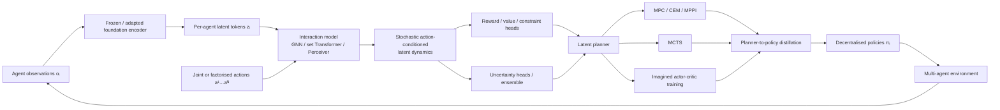
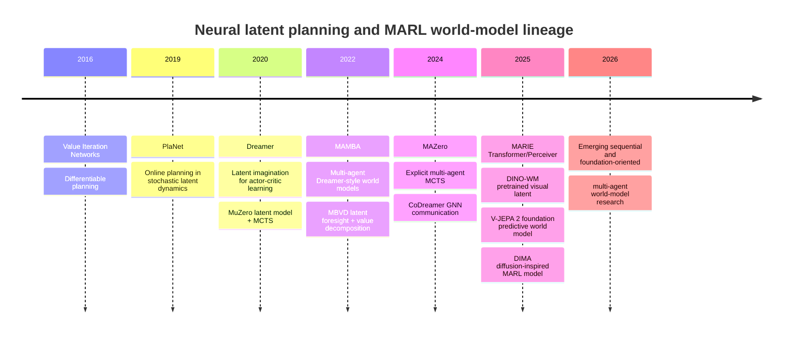
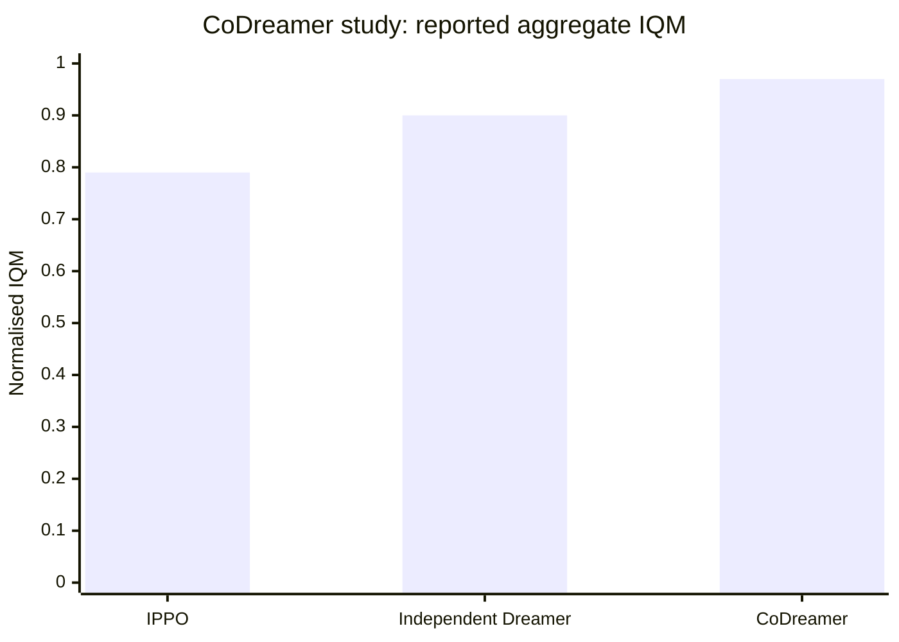

# Planning for Control in Multi-Agent Reinforcement Learning with Foundational Latent World Models

## Executive summary

The literature at the intersection of **multi-agent reinforcement learning (MARL), latent world models, explicit planning, and foundation-scale pretraining is still surprisingly sparse**. The mature neighbouring literatures are much larger: model-free MARL has highly cited methods such as MADDPG, COMA, QMIX, and MAPPO; single-agent model-based RL has PlaNet, Dreamer, MuZero, TD-MPC2, and more recently DINO-WM and V-JEPA 2; direct multi-agent world-model work includes MAMBA, MBVD, MAZero, CoDreamer, MARIE, and DIMA. <!-- cite: turn14search0, turn1search2, turn18search0, turn14search1, turn20search2, turn20search1, turn20search0, turn21academia26, turn18search2, turn19search0, turn19academia31, turn14search7, turn19search3 -->

The key conclusion is therefore not that a dominant “foundational MARL world model” paradigm already exists. Rather, **there is an unusually clean research opportunity to combine three partially disconnected lines**:

1. **MARL factorisation and decentralisation:** CTDE, value decomposition, communication, graph/set architectures and reasoning about other agents. MADDPG established centralised critics for decentralised actors; QMIX learned a centralised monotonic mixing function over decentralised utilities; MAPPO showed that a carefully implemented on-policy baseline is extremely strong. <!-- cite: turn14search0, turn18search0, turn14search1 -->
2. **Latent model-based control:** PlaNet plans online through compact stochastic latent dynamics; Dreamer learns behaviour through latent imagination; MuZero learns only quantities relevant to search rather than reconstructing the world; TD-MPC2 performs local trajectory optimisation in a decoder-free latent model. <!-- cite: turn20search2, turn20search1, turn20search0, turn21academia26 -->
3. **Foundation predictive representations:** DINO-WM demonstrates planning on top of pretrained DINOv2 representations, while V-JEPA 2 pretrains on more than one million hours of internet video and post-trains an action-conditioned latent model for physical-world planning. Large generative world models such as Genie 3 and NVIDIA Cosmos broaden world simulation, but are not yet established solutions for decentralised multi-agent control. <!-- cite: turn21search0, turn21search11, turn20search3, turn21search2, turn4search4 -->

The direct MARL-world-model literature has made important progress, but each leading method covers only part of this space. **MAMBA** uses per-agent world models plus communication and imagined rollouts; **MBVD** injects imagined future latent states into cooperative value decomposition; **MAZero** is the clearest direct example of learned latent dynamics plus explicit multi-agent search, extending the MuZero paradigm with MCTS; **CoDreamer** brings Dreamer-style imagination and GNN communication to decentralised world models; **MARIE** combines decentralised Transformer dynamics with centralised Perceiver aggregation; and **DIMA** moves toward diffusion-inspired multi-agent modelling. <!-- cite: turn18search2, turn18search3, turn19search0, turn19academia31, turn14search7, turn19search3, turn19search17 -->

My strongest research recommendation is therefore a **foundation-initialised, interaction-factorised latent world model with uncertainty-aware multi-agent predictive control**, followed by distillation into decentralised policies. Conceptually:

```math
o_t^i
\rightarrow
\underbrace{\phi_{\text{foundation}}(o_t^i)}_{\text{pretrained representation}}
\rightarrow
z_t^i
\rightarrow
\underbrace{G_\theta(\{z_t^j,a_t^j\})}_{\text{permutation-equivariant interaction}}
\rightarrow
\hat z_{t+1}^i
\rightarrow
\underbrace{\text{MPC/MCTS}}_{\text{joint planning}}
\rightarrow
\underbrace{\pi_i(a^i|h_i)}_{\text{decentralised distillation}}.
```

The genuinely novel part should **not** simply be “replace the RSSM by a Transformer”. MARIE has largely explored that direction already. <!-- cite: turn14search7, turn18search13 --> The stronger contribution is to ask whether a reusable predictive representation learned from broad visual experience can yield **control-sufficient, agent-count-generalising multi-agent dynamics**, while explicitly modelling epistemic uncertainty and planning under communication/decentralisation constraints. V-JEPA 2, DINO-WM and Genie 3 strongly motivate this direction, while Genie 3 explicitly identifies accurate simulation of interacting independent agents as an unresolved research challenge. <!-- cite: turn20search3, turn21search0, turn21search2 -->

A second major conclusion concerns evaluation. **SMAC alone should no longer be considered sufficient evidence.** SMACv2 was specifically introduced because ordinary SMAC permits non-trivial performance from open-loop policies and insufficiently tests stochasticity and partial observability. A serious world-model paper should span discrete and continuous control, vary agent counts and interaction graphs, evaluate out-of-distribution partners/configurations, and measure model calibration and planning efficiency—not just episodic return. <!-- cite: turn17search0, turn17search1 --> The standardised MARL evaluation literature further argues for stronger statistical protocols rather than isolated means over a handful of seeds. <!-- cite: turn16search2, turn16search10 -->

Finally, the most defensible **award-winning architectural ancestor** is *Value Iteration Networks*: NeurIPS/NIPS officially awarded it the 2016 Best Paper Award. VIN demonstrated that differentiable planning computations themselves can be embedded in neural networks, a concept still highly relevant to structured latent planners. <!-- cite: turn15search0, turn15search1 --> I would not overstate awards for the more recent MARL-world-model papers: their importance presently comes primarily from technical novelty and empirical results rather than verified major Best/Outstanding Paper awards.

## Scope, definitions and taxonomy

The cleanest formal starting point is a stochastic or Markov game. For $N$ agents, let

```math
\mathcal{G} =
(\mathcal S,\{\mathcal A_i\}_{i=1}^N,
P,\{r_i\}_{i=1}^N,
\{\mathcal O_i\}_{i=1}^N,\gamma),
```

where the joint action is

```math
\mathbf a_t = (a_t^1,\ldots,a_t^N)
\in \mathcal A_1\times\cdots\times\mathcal A_N.
```

In a cooperative Dec-POMDP-style setting, agents receive local observations rather than necessarily observing the global state and seek to maximise a shared return. SMAC was explicitly designed around this partially observable cooperative setting in which individual units act from local observations. <!-- cite: turn17search0 -->

The fundamental difference from single-agent planning is not merely that there are more actuators. The dynamics effectively depend on a **joint action whose combinatorial size is**

```math
|\mathcal A_{\rm joint}|=\prod_i |\mathcal A_i|.
```

Moreover, from the viewpoint of agent $i$, the behaviour of agents $j\neq i$ becomes part of the effective environment. During simultaneous learning these policies can change, creating the well-known apparent non-stationarity problem; MADDPG explicitly motivated centralised training partly through this difficulty, while theoretical model-based work shows that constructing an empirical model can decouple learning from repeated policy-update-induced instability in Markov games. <!-- cite: turn14search0, turn10search0, turn10search1 -->

The taxonomy that matters for this research problem has **several independent axes**. These are too often conflated.

| Axis | Main alternatives | What actually changes |
|---|---|---|
| **Environment learning** | Model-free / model-based | Whether a predictive transition/reward or planning-equivalent model is learned. |
| **State representation** | Raw/observational / compact latent / foundation latent | Whether prediction and planning occur directly in observation/state space or a learned representation. |
| **World-model organisation** | Centralised / independent / decentralised + communication / factorised hybrid | Whether inter-agent dynamics are represented jointly or decomposed. |
| **Planning mechanism** | No planning / imagination / MPC / trajectory optimisation / MCTS / differentiable DP | Whether the model merely augments training or is searched/optimised at decision time. |
| **Training information** | Decentralised / centralised / CTDE | Whether global state, joint actions or other privileged information may be used during learning. |
| **Execution** | Centralised / decentralised / decentralised with communication | What each deployed agent can observe and exchange. |
| **Pretraining regime** | Task-specific / multi-task / self-supervised pretrained / foundation-scale | Breadth and diversity of data before downstream control learning. |

**Model-free MARL** estimates policies and/or value functions without learning an explicit predictive model for generating hypothetical transitions. MADDPG, COMA, QMIX and MAPPO are canonical examples, although each solves the multi-agent structure differently. MADDPG uses centralised critics and decentralised actors; COMA uses a centralised critic with a counterfactual baseline for credit assignment; QMIX learns a monotonic centralised mixing network over local utilities; MAPPO shows that PPO-based CTDE can be competitive or superior to many specialised off-policy methods across several testbeds. <!-- cite: turn14search0, turn1search2, turn18search0, turn14search1 -->

**Model-based RL** introduces a model

```math
\hat P_\theta(s_{t+1},r_t\mid s_t,a_t)
```

or, in MARL,

```math
\hat P_\theta(s_{t+1},\mathbf r_t
\mid s_t,\mathbf a_t),
```

and exploits it to improve decisions or policy/value learning. Importantly, the model does not need to reproduce every physical detail. MuZero demonstrated that a learned model predicting reward, policy and value quantities relevant to search can be sufficient even without reconstructing observations or being given the true game dynamics. <!-- cite: turn20search0 --> This distinction is particularly attractive for MARL, where modelling every irrelevant visual detail becomes increasingly expensive.

**Latent-space world models** replace direct state prediction by

```math
z_t = e_\phi(o_{\leq t},a_{<t}),
\qquad
z_{t+1}\sim f_\theta(z_t,a_t),
```

with reward/value heads such as

```math
\hat r_t = r_\psi(z_t,a_t),
\qquad
\hat V_t=V_\omega(z_t).
```

PlaNet established the modern stochastic latent-dynamics planning template by combining deterministic and stochastic latent states and performing fast online planning directly through the latent model. <!-- cite: turn20search2 --> Dreamer retained learned latent dynamics but shifted the emphasis from online search to learning actor/value functions through imagined latent trajectories. <!-- cite: turn20search1 --> That distinction becomes critical when reading MARL papers: **“model-based” does not necessarily imply “test-time planning”.**

I recommend dividing planning into three categories:

```math
\boxed{\text{Model learning}}
\neq
\boxed{\text{Imagination for training}}
\neq
\boxed{\text{Online planning/search}}.
```

MAMBA, MARIE and CoDreamer rely heavily on imagined experience for policy learning. MAZero, in contrast, actually performs MCTS over its learned model. PlaNet and TD-MPC2 are single-agent examples of receding-horizon/trajectory-optimisation-style latent planning. <!-- cite: turn18search2, turn14search7, turn19academia31, turn19search0, turn20search2, turn21academia26 -->

A second crucial distinction concerns **centralisation**. CTDE does not imply that every component is centralised. It is useful to separately specify:

```math
(\text{world model},\ \text{planner},\ \text{execution policy}).
```

For example, one method might use a centralised model and centralised planner during training, then distil that solution into decentralised actors. Another can use per-agent models with message passing throughout. MARIE deliberately occupies a middle ground: local/decentralised dynamics are modelled with a shared Transformer while a Perceiver aggregates global agent information during training. <!-- cite: turn14search7, turn18search13 --> CoDreamer instead uses GNN-based communication at both world-model and policy levels. <!-- cite: turn19academia31 -->

**Foundation models for dynamics** do not yet have a universally fixed RL definition, so an operational definition is more useful. I propose reserving “foundation world model” for a model or predictive representation that is trained on **broad, heterogeneous data** and can be adapted across tasks, domains, goals or embodiments, rather than merely being a large network trained on one benchmark. NVIDIA explicitly describes its Cosmos World Foundation Model platform as general-purpose pretrained world models intended for subsequent customisation to physical-AI applications. <!-- cite: turn4search4 -->

This creates three useful levels:

| Level | Example | Interpretation |
|---|---|---|
| **Task-specific world model** | PlaNet, MAMBA, MAZero, MARIE | Dynamics primarily learned for the current environment/task distribution. |
| **Multi-task control generalist** | TD-MPC2 | One learned control/world model spans many tasks, embodiments and action spaces; the reported largest agent has 317M parameters and covers 80 tasks. <!-- cite: turn21academia26 --> |
| **Foundation predictive/world model** | V-JEPA 2, Cosmos, Genie 3 | Broad self-supervised/generative pretraining intended for substantial downstream reuse. <!-- cite: turn20search3, turn4search4, turn21search2 --> |

DINO-WM is an especially useful intermediate bridge: instead of training perception from scratch, it builds dynamics and planning on pretrained DINOv2 visual features and demonstrates zero-shot goal planning from offline trajectories. <!-- cite: turn21search0, turn21search11 --> V-JEPA 2 goes further: its visual predictive encoder was pretrained on over one million hours of internet video; an action-conditioned world model was then post-trained using less than 62 hours of unlabelled DROID robot video and used for zero-shot pick-and-place planning on Franka robots in previously unseen laboratory deployments. <!-- cite: turn20search3 -->

This is the conceptual architecture I believe the field is converging toward:



The **research gap is visible directly in this diagram**: existing MARL world-model work strongly covers the centre and right; existing foundation-model work increasingly covers the left and centre; very little mature work covers the entire pipeline simultaneously. MAMBA, MAZero, CoDreamer and MARIE are not broad foundation-pretrained dynamics systems, whereas DINO-WM and V-JEPA 2 are not multi-agent controllers. <!-- cite: turn18search2, turn19search0, turn19academia31, turn14search7, turn21search0, turn20search3 -->

## Literature lineage and high-impact papers

Citation counts below are **approximate search-index “Cited by” values observed on 8 September 2026**, included only as rough indicators of influence. They are not canonical bibliometric counts and will differ across Google Scholar, Semantic Scholar, OpenAlex and other indices.

| Work | Year / venue | Approx. citations | Why it matters here |
|---|---:|---:|---|
| **MADDPG — Multi-Agent Actor-Critic for Mixed Cooperative-Competitive Environments** | 2017, NeurIPS | ~9,303 | Seminal CTDE actor-critic; diagnoses multi-agent non-stationarity and rising policy-gradient variance. <!-- cite: turn14search0 --> |
| **QMIX** | 2018, ICML | ~5,065 | Canonical value factorisation: centralised monotonic mixing of local utilities enables decentralised greedy policies. <!-- cite: turn18search0 --> |
| **MuZero** | 2020, Nature | ~4,148 | Learned latent model + tree search; predicts planning-relevant quantities rather than reconstructing observations. <!-- cite: turn20search0 --> |
| **MAPPO / Surprising Effectiveness of PPO** | 2022, NeurIPS Datasets & Benchmarks | ~4,020 | Extremely strong model-free MARL baseline across MPE, SMAC, Hanabi and Google Research Football. <!-- cite: turn14search1 --> |
| **COMA** | 2018, AAAI | ~3,781 | Counterfactual baseline and centralised critic for multi-agent credit assignment. <!-- cite: turn1search2 --> |
| **Dreamer** | 2020, ICLR | ~2,958 | Actor/value learning from latent imagination; central ancestor of Dreamer-style MARL world models. <!-- cite: turn20search1 --> |
| **PlaNet** | 2019, ICML | ~2,716 | Stochastic latent dynamics + explicit fast online latent planning. <!-- cite: turn20search2 --> |
| **Value Iteration Networks** | 2016, NeurIPS/NIPS | ~907 | Differentiable embedded planning; **NIPS 2016 Best Paper Award**. <!-- cite: turn15search0, turn15search1 --> |
| **DreamerV3 / Mastering diverse control tasks through world models** | 2025, Nature | ~753 | General-purpose single-agent world-model control across diverse domains. <!-- cite: turn20search4 --> |
| **V-JEPA 2** | 2025, primary preprint | hundreds and rapidly growing | Foundation-scale predictive video representation plus action-conditioned latent planning. <!-- cite: turn20search3, turn3search0 --> |
| **DINO-WM** | 2025, ICML | ~315 | Pretrained visual features + learned latent world model + zero-shot goal planning. <!-- cite: turn21search0, turn21search11 --> |
| **Model-Based MARL in Zero-Sum Markov Games** | 2020, NeurIPS | ~207 | Near-optimal sample-complexity theory for learning an empirical model and planning in Markov games. <!-- cite: turn10search0, turn10search1 --> |
| **MAMBA** | 2022, AAMAS | ~order $10^2$ | Early scalable Dreamer-style multi-agent model-based approach; per-agent models, communication and imagination. <!-- cite: turn18search2 --> |
| **MAZero** | 2024, ICLR | ~38 | Most direct MuZero-style multi-agent planning work in the reviewed core: learned model + MCTS. <!-- cite: turn19search0 --> |
| **Mingling Foresight with Imagination / MBVD** | 2022, NeurIPS | ~32 | Couples model-based latent foresight with cooperative value decomposition. <!-- cite: turn18search3, turn5search0 --> |
| **MARIE** | 2025, TMLR | ~21 | Transformer autoregressive local dynamics + central Perceiver aggregation; highly relevant architecture. <!-- cite: turn14search7, turn19search11 --> |
| **DIMA** | 2025, NeurIPS | ~15 | Diffusion-inspired multi-agent world modelling; part of the next generation beyond RSSM/Transformer designs. <!-- cite: turn19search3, turn19search17 --> |
| **CoDreamer** | 2024 | emerging | Dreamer-style decentralised world models with GNN communication at world-model and policy levels. <!-- cite: turn19academia31 --> |

Two historical trajectories are worth keeping mentally separate.

The first is the **planning lineage**:



The second is the **MARL factorisation lineage**: centralised critics such as MADDPG and COMA, factorised values such as VDN/QMIX, increasingly strong policy-gradient CTDE such as MAPPO, and then models that attempt to bring dynamics prediction into the same framework. <!-- cite: turn14search0, turn1search2, turn18search0, turn14search1 -->

### Direct comparison of multi-agent world-model approaches

The most useful comparison is not simply “model-based versus model-free”, but *where the world model lives and how its predictions actually affect control*.

| Method | World-model architecture | Model organisation | Planning / use of model | Execution | Main benchmarks | Reported highlight |
|---|---|---|---|---|---|---|
| **MAMBA** | Dreamer-style/RSSM world models with inter-agent communication | Primarily per-agent / communication-supported | Imagined rollouts for policy learning | Distributed agents with communication | SMAC, Flatland | Reports up to roughly an order-of-magnitude reduction in real environment interaction against strong model-free methods. <!-- cite: turn18search2 --> |
| **MBVD / Mingling Foresight with Imagination** | Learned implicit/latent model integrated with value decomposition | CTDE / factorised value learning | Evaluates present decisions using imagined future latent states | Decentralised policies | Cooperative partially observable tasks | Reports improved performance and data efficiency by injecting model-derived foresight into value learning. <!-- cite: turn18search3, turn5search0 --> |
| **MAZero** | MuZero-style latent representation, dynamics and prediction heads | Centralised learned model for planning | **MCTS at decision/training time** | Decentralised policy, including parameter sharing | SMAC | Reports better sample efficiency than model-free baselines and strong sample/compute efficiency relative to model-based baselines. <!-- cite: turn19search0, turn18search28 --> |
| **CoDreamer** | Dreamer-style stochastic world models + GNN modules | Decentralised models with learned communication | Latent imagination / actor-critic learning | Decentralised with communication | VMAS and Melting Pot-style tasks | Outperforms independent Dreamer and model-free baselines across reported environments. <!-- cite: turn19academia31, turn7view2 --> |
| **MARIE** | Shared autoregressive Transformer for local dynamics + Perceiver global aggregation | Hybrid: decentralised local prediction + central aggregation | Long-horizon imagination used to accelerate policy learning | World model can be discarded after training; decentralised policy | SMAC, MAMuJoCo | Reports stronger low-data performance than prior model-free and comparable model-based approaches. <!-- cite: turn14search7, turn19search11 --> |
| **DIMA** | Diffusion-inspired multi-agent world model | Joint/factorised multi-agent modelling | Imagination-based policy learning | MARL control policy | Multiple multi-agent control benchmarks | Reports state-of-the-art results and improved modelling efficiency relative to Transformer-style alternatives. <!-- cite: turn19search3, turn18search19 --> |

This table exposes an important distinction: **MAZero is closer to classical planning for control than MAMBA/MARIE/CoDreamer**. The latter learn from model-generated experience but usually amortise their decisions into a policy, whereas MAZero explicitly searches its learned latent future via MCTS. <!-- cite: turn19search0, turn18search2, turn14search7, turn19academia31 -->

The single-agent works should not be treated merely as historical background. They provide design options that MARL has not fully exploited:

| Single-agent ancestor | Representation | Objective / model | Planner | Important transferable idea |
|---|---|---|---|---|
| **PlaNet** | Stochastic recurrent latent | Variational latent dynamics, reward modelling | Online latent trajectory optimisation | Receding-horizon planning without pixel-space rollouts. <!-- cite: turn20search2 --> |
| **Dreamer** | RSSM latent | Generative/stochastic latent model | Imagined actor/value gradients | Amortise planning into actor learning. <!-- cite: turn20search1 --> |
| **MuZero** | Learned implicit latent | Reward/value/policy-equivalent predictions | MCTS | Model only what planning needs. <!-- cite: turn20search0 --> |
| **IRIS** | Discrete tokens | Autoencoder + autoregressive Transformer | Imagination for policy learning | Transformer world modelling under tight data budgets. <!-- cite: turn11search13 --> |
| **STORM** | Stochastic Transformer latent | Transformer stochastic dynamics | Imagination | Strong temporal modelling without recurrent RSSM dominance. <!-- cite: turn11search2 --> |
| **TD-MPC2** | Decoder-free implicit latent | Dynamics + reward/value/control objectives | Local latent trajectory optimisation | Very attractive for continuous multi-robot MPC; demonstrated scaling to 104 tasks and a 317M-parameter 80-task agent. <!-- cite: turn21academia26 --> |
| **DINO-WM** | Pretrained DINOv2 feature latent | Offline feature-space dynamics | Goal-conditioned latent planning | Separates foundation perception from task dynamics. <!-- cite: turn21search0 --> |
| **V-JEPA 2-AC** | Foundation predictive video latent | JEPA-style SSL + action-conditioned post-training | Image-goal latent planning | Broad observation pretraining before interaction-grounded dynamics learning. <!-- cite: turn20search3 --> |

Theoretical model-based MARL is also important because it undermines a common misconception: world models are not only an empirical sample-efficiency trick. For discounted tabular two-player zero-sum Markov games, Zhang and collaborators showed near-optimal model-based sample-complexity results and argued that estimating a model separates environment learning from planning; their bounds scale with state/action cardinalities and approximately $(1-\gamma)^{-3}\epsilon^{-2}$ up to logarithmic factors in the relevant setting. <!-- cite: turn10search0, turn10search1 --> The missing theoretical bridge is from such tabular results to **learned representations, partial observability, decentralised policies and many-agent factorised dynamics**.

## Technical approaches

A useful general latent multi-agent model is

```math
z_t^i = E_\phi(h_t^i),
```

```math
c_t^i =
\operatorname{Interact}_\theta
\left(
z_t^i,\{z_t^j\}_{j\in\mathcal N(i)}
\right),
```

```math
z_{t+1}^i
\sim
p_\theta
\left(
z_{t+1}^i
\mid
z_t^i,c_t^i,
a_t^i,
\{a_t^j\}_{j\in\mathcal N(i)}
\right),
```

with team-level prediction

```math
\hat r_t =
R_\psi(\{z_t^i\},\mathbf a_t),
\qquad
\hat V_t=V_\omega(\{z_t^i\}).
```

This formulation separates **individual temporal dynamics** from **interaction dynamics**, which is much more scalable than treating every possible multi-agent configuration as an unrelated monolithic state.

**Recurrent stochastic state-space models.** PlaNet and Dreamer popularised RSSM-like representations that combine deterministic recurrent memory with stochastic latent variables, helping maintain long-term information while representing multiple plausible futures. <!-- cite: turn20search2, turn20search1 --> MAMBA transfers this family to multi-agent control, maintaining world models using inter-agent communication and learning policies from imagined rollouts. <!-- cite: turn18search2 --> The strength is data efficiency and compact simulation; the weakness is that multi-modal multi-agent futures can become increasingly difficult as policies and interactions diversify.

A typical variational objective has the schematic form

```math
\mathcal L_{\rm WM}
=
\lambda_o\mathcal L_{\rm observation}
+
\lambda_r\mathcal L_{\rm reward}
+
\beta D_{\rm KL}
\left[
q_\phi(z_t|o_{\le t})
\Vert
p_\theta(z_t|z_{t-1},a_{t-1})
\right].
```

For control, reconstructing every pixel is not always desirable. MuZero's success is strong evidence that a model can instead be trained toward **planning-equivalent predictions**, learning rewards, policies and values without being required to recreate the observation. <!-- cite: turn20search0 --> TD-MPC2 similarly uses a decoder-free implicit latent model and performs trajectory optimisation there. <!-- cite: turn21academia26 -->

**Contrastive and predictive latent objectives.** Reconstruction may waste capacity on task-irrelevant texture, lighting and background details. Predictive/contrastive representations instead encourage the model to capture transformations relevant across time. DINO-WM shows that planning can be built directly in pretrained feature space, while V-JEPA 2 predicts latent visual representations and then acquires action conditioning in a comparatively small post-training phase. <!-- cite: turn21search0, turn20search3 -->

For a MARL extension, an especially attractive loss is

```math
\mathcal L_{\rm pred}
=
d\!\left(
\hat z_{t+k}^{i},
\operatorname{sg}
[E_{\rm target}(o_{t+k}^{i})]
\right),
```

where $\operatorname{sg}$ denotes stop-gradient. I would augment this with a **counterfactual-interaction objective**:

```math
\mathcal L_{\rm cf}
=
d\left(
f(z_t,\mathbf a_t),
z_{t+1}
\right)
+
\lambda_{\rm int}
d\left(
\Delta_i(\mathbf a_t,\tilde a_t^j),
\widehat{\Delta}_i
\right),
```

forcing the model to learn not just “what happens next” but **which other agent caused what change**. That is much more aligned with MARL planning and credit assignment than ordinary next-frame prediction.

**Transformers.** Transformers are natural when trajectories, agent states and actions can all be tokenised. MARIE explicitly casts local multi-agent dynamics learning as autoregressive sequence modelling over discrete tokens using a shared Transformer, with a Perceiver-style global aggregator to integrate information across agents. <!-- cite: turn14search7, turn18search13 --> The appeal is long-context modelling and architectural sharing across agents. The danger is quadratic token attention unless interaction sparsity, Perceiver bottlenecks or factorised attention are used.

**Graph neural networks and set architectures.** GNNs provide an inductive bias that is unusually well matched to multi-agent physics:

```math
m_{ij}
=
\phi_e(z_i,z_j,a_i,a_j),
\qquad
m_i=\sum_{j\in\mathcal N(i)}m_{ij},
```

```math
z_{t+1}^i
=
\phi_v(z_t^i,a_t^i,m_i).
```

This provides permutation equivariance and naturally supports different numbers of agents. CoDreamer uses GNN communication in both learned world models and policies, specifically targeting partial observability and inter-agent cooperation. <!-- cite: turn19academia31 --> For swarm robotics or many-agent systems, this inductive bias is in my view stronger than simply concatenating all agents into a giant Transformer token sequence.

**Diffusion-style dynamics.** Multi-agent futures are often deeply multi-modal: at an intersection two autonomous cars may yield in several valid ways; in football multiple passes may all be plausible. DIMA represents a recent move toward diffusion-inspired world modelling and reports competitive or state-of-the-art control performance while directly comparing against MAMBA and MARIE. <!-- cite: turn19search3, turn18search19 --> The research question is whether the added distributional expressivity justifies iterative sampling cost during online planning.

The main planning methods then sit on top of these models.

**Model predictive control** repeatedly solves

```math
\mathbf a_{t:t+H-1}^{*}
=
\arg\max_{\mathbf a_{t:t+H-1}}
\mathbb E_{\hat P_\theta}
\left[
\sum_{k=0}^{H-1}\gamma^k
r(z_{t+k},\mathbf a_{t+k})
+
\gamma^H V(z_{t+H})
\right]
```

and executes only the first action before replanning. PlaNet is a canonical latent-space example. <!-- cite: turn20search2 --> The receding horizon is especially valuable under imperfect world models because newly observed information continually corrects the latent belief.

With $N$ agents and $m$ discrete actions each, exhaustive $H$-step joint search scales as

```math
m^{NH},
```

which is clearly unusable beyond tiny systems. Thus **multi-agent MPC should optimise a factored action distribution rather than enumerate the joint tree**:

```math
q(\mathbf a_{t:t+H})
=
\prod_{i=1}^{N}
q_i(a^i_{t:t+H}\mid c_i).
```

Cross-Entropy Method, MPPI-like sampling or learned proposal policies can optimise these factors while still evaluating complete joint rollouts.

**Trajectory optimisation** is particularly natural in continuous robotic action spaces. TD-MPC2 performs local trajectory optimisation directly inside a learned decoder-free latent model. <!-- cite: turn21academia26 --> A multi-agent extension could optimise per-agent action sequences jointly while exploiting sparse graph coupling.

**MCTS** trades broad trajectory sampling for adaptive tree expansion. MuZero demonstrates the power of latent MCTS in single-agent/game settings; MAZero transfers this general idea into MARL. <!-- cite: turn20search0, turn19search0 --> The central challenge is again branching factor: standard MCTS sees a joint action space that grows exponentially with $N$. This makes progressive widening, action factorisation, coordination graphs or sequential agent-action generation important research directions.

**Differentiable dynamic programming** is represented historically by Value Iteration Networks. VIN embeds an approximate differentiable planning computation within a neural policy and received the official NIPS 2016 Best Paper Award. <!-- cite: turn15search0, turn15search1 --> In modern MARL, an intriguing revival would replace a flat value-iteration grid with a **learned latent interaction graph**, performing message-passing Bellman backups across factorised agent/action factors.

**Latent imagination** deserves separate treatment. Dreamer does not perform an expensive optimisation process for each environment action; instead, it generates trajectories through the world model and trains actor/value functions on those imagined futures. <!-- cite: turn20search1 --> MAMBA and CoDreamer inherit much of this philosophy in MARL. <!-- cite: turn18search2, turn19academia31 --> This is computationally attractive at deployment because search can be amortised.

Hence an ideal architecture may use **both**:

```math
\text{expensive planner}
\rightarrow
\text{high-quality targets}
\rightarrow
\text{decentralised actor distillation},
```

with occasional MPC/search correction when uncertainty becomes high.

Training can then proceed in stages rather than end-to-end from scratch.

```math
\boxed{\text{Broad SSL pretraining}}
\rightarrow
\boxed{\text{Action grounding}}
\rightarrow
\boxed{\text{Multi-agent dynamics}}
\rightarrow
\boxed{\text{Planning}}
\rightarrow
\boxed{\text{Policy distillation}}.
```

V-JEPA 2 provides direct evidence for this decomposition: broad action-free video pretraining precedes action-conditioned post-training with a much smaller quantity of robotic interaction data. <!-- cite: turn20search3 --> DINO-WM similarly shows the benefit of using pretrained representations rather than jointly relearning visual perception with every new dynamics model. <!-- cite: turn21search0 -->

This is a much more promising path to “foundation MARL world models” than trying to train a billion-parameter MARL model from scratch on SMAC.

## Benchmarks and evaluation

The benchmark suite should answer **five different questions**: Can the agents coordinate? Can the world model predict? Can the planner exploit it? Does it generalise? Is it computationally viable?

SMAC remains historically important because it standardised partially observable cooperative micromanagement with one learning agent per StarCraft unit. <!-- cite: turn17search0 --> However, SMACv2 was created specifically after researchers found that original SMAC lacked enough stochasticity and partial observability: even timestep-conditioned open-loop policies could obtain non-trivial win rates on many scenarios. SMACv2 adds procedural generation and stronger partial-observability variants so agents must rely on closed-loop information. <!-- cite: turn17search1 --> Therefore, a 2026 paper centred only on SMAC-v1 would provide weak evidence for a supposedly foundational world model.

A rigorous benchmark matrix would be:

| Benchmark family | Why include it | Recommended world-model stress test |
|---|---|---|
| **SMACv2 / SMAX** | Discrete cooperative control, partial observability, variable scenarios | Multi-step transition/reward prediction; unseen compositions; closed-loop win rate. SMACv2 fixes important SMAC weaknesses. <!-- cite: turn17search1 --> |
| **MAMuJoCo** | Continuous cooperative control with coupled physical dynamics | MPC accuracy, action perturbations, long-horizon joint locomotion. Papoudakis et al. include diverse cooperative benchmark classes. <!-- cite: turn16search15, turn16search19 --> |
| **VMAS** | Fast vectorised multi-agent physics and swarm-style tasks | Scaling with $N$, sparse interaction graphs and communication radius; used by CoDreamer-style work. <!-- cite: turn19academia31, turn7view2 --> |
| **Melting Pot** | Rich partially observable social interaction from pixels | Foundation visual representation, partner adaptation, non-stationary social dynamics; CoDreamer evaluated pixel-based multi-agent settings of this kind. <!-- cite: turn7view2 --> |
| **Flatland** | Many-agent routing/scheduling | Large-agent scaling and long-horizon coordination; MAMBA reports results here. <!-- cite: turn18search2 --> |
| **MPE** | Cheap canonical debugging domain | Sanity checks and fast ablations, but insufficient as primary evidence. MAPPO includes it among four benchmark families. <!-- cite: turn14search1 --> |
| **Google Research Football** | More complex coordinated sequential action | Long-horizon credit assignment and opponent/team dynamics; used in MAPPO benchmark evaluation. <!-- cite: turn14search1 --> |
| **JaxMARL/SMAX infrastructure** | High-throughput repeated evaluation | Makes large seed sweeps more practical; JaxMARL reports enormous wall-clock acceleration through JAX/vectorisation. <!-- cite: turn17search11, turn17search19 --> |

Papoudakis et al.'s benchmark study is useful because it systematically compares independent learners, centralised policy-gradient methods and value-decomposition approaches over multiple cooperative task classes rather than relying on one environment. <!-- cite: turn16search15, turn16search19 --> Gorsane et al. subsequently argued for a standardised performance-evaluation protocol in cooperative MARL precisely because inconsistent evaluation and small-sample comparisons make claims difficult to reproduce or compare. <!-- cite: turn16search2, turn16search10 -->

For a world-model paper, return/win rate alone is inadequate. I recommend five metric families.

**Control performance** should include episodic return, success/win rate, interquartile mean across tasks, median normalised score, probability of improvement versus each baseline, confidence intervals across seeds, and worst-decile performance where failures matter. The standardised-evaluation literature provides direct motivation for moving beyond isolated means. <!-- cite: turn16search2, turn16search10 -->

**Sample efficiency** should be measured as

```math
\operatorname{AUC}
=
\int_0^B J(n)\,dn,
```

where $B$ is a fixed environment-interaction budget, plus “steps to threshold” such as

```math
N_\tau
=
\min\{n:J(n)\ge\tau\}.
```

This matters because the central empirical motivation for MAMBA, MARIE and other world-model MARL systems is achieving strong policies from substantially fewer environment interactions. <!-- cite: turn18search2, turn14search7 -->

**World-model fidelity** should be measured separately from policy return:

```math
E_k
=
\mathbb E[
d(\hat z_{t+k},z_{t+k})
],
```

for rollout horizons $k=1,2,4,8,16,\ldots$, together with reward-prediction error, terminal/event prediction, latent retrieval accuracy, and—for stochastic models—proper scoring rules/calibration.

Most importantly for MARL, measure **counterfactual joint-action accuracy**:

```math
E_{\rm CF}
=
\mathbb E_{\mathbf a,\tilde{\mathbf a}}
\left[
d\left(
\hat s_{t+1}(\tilde a^j,\mathbf a^{-j}),
s_{t+1}(\tilde a^j,\mathbf a^{-j})
\right)
\right].
```

A world model may predict on-policy trajectories accurately while completely misunderstanding causal interactions between agents. Such a model is dangerous for planning because planning deliberately queries **counterfactual actions**.

**Planning efficiency** should record

```math
\text{return per environment step},
\qquad
\text{return per model rollout},
\qquad
\text{return per GPU-second},
```

plus model calls/action, planning latency, memory consumption and energy/accelerator hours where feasible. This distinguishes an algorithm that saves data by spending 1,000 times more compute from one that is genuinely efficient. MAZero explicitly emphasises sample and computational efficiency of its planning approach, while TD-MPC2 provides an example of scalable latent trajectory optimisation. <!-- cite: turn19search0, turn21academia26 -->

**Generalisation** should include held-out:

```math
N_{\rm agents},\quad
\text{maps},\quad
\text{initial states},\quad
\text{partner policies},\quad
\text{opponents},\quad
\text{embodiments},\quad
\text{visual conditions}.
```

SMACv2's procedural generation is explicitly designed to force within-distribution scenario generalisation. <!-- cite: turn17search1 --> A foundation-model claim requires substantially more: train on $N\in\{3,5,8\}$, for example, and evaluate zero-shot on $N\in\{10,12,16\}$, or train with one partner population and test with unseen strategies.

A controlled result from CoDreamer illustrates why aggregate statistics are useful. In its reported aggregate comparison, the interquartile mean scores were approximately 0.79 for IPPO, 0.90 for independent Dreamer and 0.97 for CoDreamer; the same analysis reported substantially smaller aggregate optimality gap for CoDreamer. <!-- cite: turn7view2 -->



These numbers are intentionally **not** mixed with metrics from unrelated papers. Cross-paper MARL scores are generally not comparable unless environment versions, budgets, preprocessing and evaluation procedures coincide; the standardisation work was motivated by exactly this problem. <!-- cite: turn16search2 -->

## Limitations and failure modes

The first failure mode is **compounding model error**. Suppose the learned transition has small one-step error,

```math
d(
P(\cdot|z,a),
\hat P(\cdot|z,a)
)
\le \epsilon.
```

Repeated imagination can move the model into latent states never well supported by real observations, so the error over horizon $H$ can grow far beyond the one-step $\epsilon$. PlaNet's emphasis on accurate multi-step reward prediction and the broad Dreamer lineage exist precisely because long-range model quality matters for control. <!-- cite: turn20search2, turn20search1 --> In MARL the problem is amplified because prediction depends on several agents' future actions.

The closely related phenomenon is **model exploitation**. Planning computes

```math
\arg\max_{\mathbf a_{1:H}}
\hat J(\mathbf a_{1:H}),
```

so it intentionally searches for trajectories the model predicts to be excellent. That can select precisely those out-of-distribution trajectories where the model's errors are largest. Ensembles, pessimistic values or uncertainty penalties are consequently particularly important in model-based MARL.

The second fundamental problem is **multi-agent non-stationarity**. A decentralised predictor for agent $i$,

```math
p(s_{t+1}^i|s_t^i,a_t^i),
```

is misspecified whenever $s_{t+1}^i$ depends materially on agents $j\neq i$. MADDPG highlighted non-stationarity as a core issue in multi-agent learning; MARIE's motivation explicitly contrasts the scalability problems of fully centralised dynamics against the non-stationarity faced by purely decentralised local models. <!-- cite: turn14search0, turn14search7 -->

This creates a central dilemma:

```math
\text{centralised joint model}
\Rightarrow
\text{better interaction information, poorer scaling},
```

whereas

```math
\text{independent local models}
\Rightarrow
\text{better scaling, omitted interaction dynamics}.
```

MARIE's central aggregation and CoDreamer's communication are two attempts to occupy the middle. <!-- cite: turn14search7, turn19academia31 -->

Third is the **joint-action curse**. If every agent has $m$ actions, one-step joint branching is $m^N$, and an exhaustive $H$-step planner sees $m^{NH}$ sequences. This is not merely a neural-network scaling issue; it is a structural planning problem. MAZero therefore demonstrates feasibility in selected MARL tasks but does not eliminate the general combinatorial problem of many-agent search. <!-- cite: turn19search0 -->

Fourth is **partial observability and latent belief inconsistency**. Under a Dec-POMDP, different agents can have mutually inconsistent histories. A centralised training model may form an excellent global latent state that no individual agent could infer during deployment. A high-performing planner can therefore create an unrealisable policy unless its outputs are explicitly constrained or distilled to the agents' execution-time information sets. SMAC and SMACv2 are deliberately partially observable, and SMACv2 strengthens this aspect because original SMAC did not always force policies to react meaningfully to observations. <!-- cite: turn17search0, turn17search1 -->

Fifth, **pretrained representations may be predictive yet not control-sufficient**. A frozen visual encoder can collapse visually subtle variables such as velocity, contact state, possession, line-of-sight or another agent's intention. DINO-WM and V-JEPA 2 demonstrate that pretrained representations can be highly useful for downstream planning, but neither result proves universal sufficiency for multi-agent control. <!-- cite: turn21search0, turn20search3 --> An important experiment is therefore frozen features versus adapted features under interaction-sensitive tasks.

Sixth, **good generative video is not equivalent to good control dynamics**. A visually plausible predicted collision with slightly incorrect geometry can be useless for control. Conversely, MuZero demonstrates that a model may be extremely useful for planning without attempting realistic observation generation at all. <!-- cite: turn20search0 --> This is why I would resist evaluating a MARL world model primarily with pixel reconstruction metrics.

Seventh, **multi-modal futures become much harder when several agents independently act**. A deterministic predictor may average mutually exclusive outcomes. Diffusion-inspired models such as DIMA address richer future distributions, but iterative generative sampling also adds planning latency. <!-- cite: turn19search3 --> This creates an explicit quality-versus-online-compute trade-off.

Eighth, **world-foundation models themselves still struggle with multi-agent interaction**. Google DeepMind's published Genie 3 limitations explicitly state that accurately modelling complex interactions between multiple independent agents in shared environments remains an ongoing research challenge; Genie 3 also has a constrained direct action space. <!-- cite: turn21search2 --> This is unusually strong primary-source evidence that the requested research intersection remains genuinely open rather than merely under-cited.

Ninth, there is a **benchmark validity problem**. Original SMAC's open-loop weakness means that high win rate need not imply sophisticated latent state estimation or reactive planning. <!-- cite: turn17search1 --> Any claimed world-model advantage must therefore include perturbations, stochasticity, procedural generalisation and counterfactual actions that force the model to predict something meaningful.

Tenth, there is a **statistics and reproducibility problem**. MARIE itself notes limitations arising from a small number of seeds and discusses the need for more rigorous standardised evaluation, while the broader MARL evaluation literature explicitly argues that inconsistent protocols obstruct valid comparisons. <!-- cite: turn14search7, turn16search2 -->

Finally, sample efficiency and compute efficiency can conflict severely. CoDreamer's reported final experimental campaign involved about 140 runs requiring roughly 1,260 TPU-hours, with individual runs in the order of several hours. <!-- cite: turn7view2 --> A research programme should therefore report both environment interactions and accelerator cost.

## Research gaps and proposed contributions

The strongest gap is what I would call the **foundation-to-control gap**.

We now know that broad self-supervised representations can support downstream dynamics learning and planning: DINO-WM demonstrates this using DINOv2 features and V-JEPA 2 provides a much larger-scale example using internet video followed by comparatively small action-conditioned post-training. <!-- cite: turn21search0, turn20search3 --> We also know that MARL world models can improve sample efficiency through imagination, communication, Transformers or MCTS. <!-- cite: turn18search2, turn19search0, turn19academia31, turn14search7 --> Yet the reviewed mature literature does not provide a well-established system combining **foundation-pretrained latent representations + explicit inter-agent dynamics + scalable planning + decentralised execution**.

I would centre a thesis or strong conference project around **Foundation Latent Multi-Agent Predictive Control**, abbreviated here as **FL-MAPC**.

Its world state would be represented as a variable-size set

```math
Z_t =
\{z_t^1,\ldots,z_t^N,z_t^{\rm objects},z_t^{\rm scene}\},
```

where

```math
z_t^i =
A_\eta
\left[
F_{\rm foundation}(o_t^i)
\right].
```

$F$ is initially frozen V-JEPA-2-like or DINO-like perception and $A_\eta$ is a lightweight trainable control adapter. DINO-WM and V-JEPA 2 provide direct primary-source motivation for this “pretrained representation + downstream dynamics” decomposition. <!-- cite: turn21search0, turn20search3 -->

Dynamics should factorise as

```math
\hat z_{t+1}^i
=
f_{\rm self}(z_t^i,a_t^i)
+
\sum_{j\in \mathcal N_t(i)}
f_{\rm pair}(z_t^i,z_t^j,a_t^i,a_t^j)
+
f_{\rm global}(z_t^i,g_t),
```

with

```math
g_t =
\operatorname{SetAgg}(\{z_t^j\}_{j=1}^{N}).
```

The graph term learns pairwise/local interactions; the global set term handles non-local coordination. This combines the GNN motivation of CoDreamer with MARIE's centralised aggregation idea, but introduces a foundation-pretrained representation and explicit sparse dynamics decomposition. <!-- cite: turn19academia31, turn14search7 -->

I would train it with

```math
\mathcal L =
\lambda_{\rm JEPA}\mathcal L_{\rm latent}
+
\lambda_{\rm dyn}\mathcal L_{\rm stochastic}
+
\lambda_r\mathcal L_{\rm reward}
+
\lambda_V\mathcal L_{\rm value}
+
\lambda_{\rm CF}\mathcal L_{\rm counterfactual}
+
\lambda_{\rm U}\mathcal L_{\rm uncertainty}.
```

The conceptual innovation is that each term addresses a different notion of sufficiency:

| Loss | Purpose |
|---|---|
| $\mathcal L_{\rm latent}$ | Preserve broad predictive structure without reconstructing nuisance pixels. |
| $\mathcal L_{\rm stochastic}$ | Represent multi-modal futures. |
| $\mathcal L_r$ | Ground representation in control consequences. |
| $\mathcal L_V$ | Encourage planning/value equivalence. |
| $\mathcal L_{\rm counterfactual}$ | Learn causal influence of other agents' actions. |
| $\mathcal L_{\rm uncertainty}$ | Prevent aggressive planning through unsupported latent futures. |

The second major contribution should be **factorised uncertainty-aware MPC**. Instead of enumerating joint actions, maintain agent-wise proposal distributions:

```math
q(\mathbf a_{t:t+H})
=
\prod_iq_i
\left(
a_{t:t+H}^i
\mid
z_t^i,m_t^i
\right).
```

Sample $K$ joint trajectories, score each using

```math
S(\tau)
=
\mathbb E[\hat R(\tau)]
-
\beta
\,\operatorname{Uncertainty}(\tau),
```

retain elites, and update $q_i$. For a sparse interaction model, the expensive neural dynamics computation can potentially scale with agents and interaction edges rather than requiring explicit enumeration of every joint action combination. This should be treated as an **algorithmic research objective**, not an already established guarantee.

The planner would train a decentralised student:

```math
\mathcal L_{\rm distill}
=
\sum_i
D_{\rm KL}
\left[
\pi_{\rm plan}^i(\cdot|Z_t)
\Vert
\pi_i(\cdot|h_t^i,m_t^i)
\right].
```

That explicitly solves the mismatch between a powerful privileged planner and execution-time information constraints. Search can then be disabled in latency-critical deployment or invoked only when world-model uncertainty exceeds a threshold.

The third contribution should be **uncertainty decomposition**:

```math
U =
U_{\rm aleatoric}
+
U_{\rm epistemic}
+
U_{\rm strategic}.
```

Aleatoric uncertainty represents inherent environment randomness. Epistemic uncertainty represents world-model ignorance. Strategic uncertainty represents uncertainty about **what another agent will decide**. Standard single-agent world models usually merge the latter two or do not encounter the strategic category at all. This distinction could produce a genuinely MARL-specific world-model contribution.

A practical implementation could use a small ensemble,

```math
\{\hat f_{\theta_1},\ldots,\hat f_{\theta_M}\},
```

with

```math
U_{\rm epistemic}
=
\operatorname{Var}_m[
\hat z_{t+1}^{(m)}
],
```

while a separate teammate-policy head

```math
p_\psi(a_{t+1}^{-i}|h_t^{-i})
```

represents strategic uncertainty. The planner can become pessimistic only where epistemic uncertainty is high rather than penalising inherently stochastic but well-modelled interactions.

A fourth contribution is **agent-count and topology generalisation**. Train on one distribution,

```math
N \sim p_{\rm train}(N),
```

and test on

```math
N\notin\operatorname{support}(p_{\rm train})
```

while preserving interaction rules. A set/GNN architecture makes this far more principled than fixed-dimensional concatenation. The benchmark should report performance as a function of $N$, edge density $|E|/N^2$, communication radius and planner budget.

The theoretical research opportunity is particularly strong. Existing model-based Markov-game theory establishes strong sample-complexity results in tabular settings, but does not settle learned latent representations in decentralised partially observable many-agent control. <!-- cite: turn10search0, turn10search1 --> A useful target theorem would decompose performance loss into:

```math
J(\pi^\star)-J(\hat\pi)
\lesssim
C(H)
\left(
\epsilon_{\rm repr}
+
\epsilon_{\rm dyn}
+
\epsilon_{\rm int}
+
\epsilon_{\rm plan}
+
\epsilon_{\rm dec}
\right),
```

where

- $\epsilon_{\rm repr}$ measures information lost by the latent representation;
- $\epsilon_{\rm dyn}$ is temporal model error;
- $\epsilon_{\rm int}$ is inter-agent interaction-model error;
- $\epsilon_{\rm plan}$ is approximate-search error;
- $\epsilon_{\rm dec}$ is loss caused by converting a centralised plan into decentralised policies.

This equation is a **proposed decomposition to prove**, not a theorem claimed from existing literature. A very valuable theoretical result would show when sparse interaction graphs make the bound depend on maximum neighbourhood degree $d$ rather than directly on total agent count $N$.

A fifth contribution should be evaluative rather than architectural: a **WorldMARL-Plan protocol**.

Every model would be scored on a vector

```math
\mathcal M=
(
\underbrace{J}_{\text{control}},
\underbrace{\mathrm{AUC}}_{\text{sample efficiency}},
\underbrace{E_{1:H}}_{\text{rollout fidelity}},
\underbrace{E_{\rm CF}}_{\text{counterfactual fidelity}},
\underbrace{\mathrm{Cal}}_{\text{uncertainty}},
\underbrace{G_{\rm agents}}_{\text{agent-count generalisation}},
\underbrace{G_{\rm partners}}_{\text{partner generalisation}},
\underbrace{C_{\rm plan}}_{\text{planning cost}}
).
```

This would directly address the benchmark-standardisation concerns raised in MARL and the weaknesses of relying solely on original SMAC win rates. <!-- cite: turn16search2, turn17search1 -->

The most important ablation is **not** Transformer versus GNN. It is:

```math
\boxed{
\text{Does foundation pretraining improve multi-agent control
after controlling for architecture and parameter count?}
}
```

Compare:

```math
\text{random encoder}
\quad\text{vs}\quad
\text{single-task pretrained encoder}
\quad\text{vs}\quad
\text{DINO-style frozen encoder}
\quad\text{vs}\quad
\text{V-JEPA-style encoder}
\quad\text{vs}\quad
\text{fine-tuned foundation encoder}.
```

Then evaluate whether improvement comes from better **in-distribution fitting** or true **generalisation to new agents, layouts, visual domains and interaction patterns**. Without these controls, “foundation world model” risks becoming merely branding for a larger visual backbone.

## Prioritised reading list and experimental validation plan

For someone intending to do research rather than merely survey papers, I would read the literature in the following order. The ordering reflects conceptual dependency, not citation count.

| Priority | Paper | What to learn |
|---:|---|---|
| **Essential** | **PlaNet — Learning Latent Dynamics for Planning from Pixels**, ICML 2019 | The cleanest starting point for stochastic latent dynamics + online planning. <!-- cite: turn20search2 --> |
| **Essential** | **Dream to Control**, ICLR 2020 | Understand latent imagination, RSSMs and actor/value learning inside a world model. <!-- cite: turn20search1 --> |
| **Essential** | **MuZero**, Nature 2020 | Understand planning-equivalent latent models and MCTS without reconstructing observations. <!-- cite: turn20search0 --> |
| **Essential** | **QMIX**, ICML 2018 | Learn why cooperative joint values need factorisation for decentralised execution. <!-- cite: turn18search0 --> |
| **Essential** | **MADDPG**, NeurIPS 2017 | Learn CTDE and the multi-agent non-stationarity problem. <!-- cite: turn14search0 --> |
| **Essential** | **MAPPO / Surprising Effectiveness of PPO**, NeurIPS 2022 | Establish the model-free baseline you actually have to beat. <!-- cite: turn14search1 --> |
| **Core direct MARL-WM** | **MAMBA**, AAMAS 2022 | Understand per-agent Dreamer-style world models, communication and imagined policy learning. <!-- cite: turn18search2 --> |
| **Core direct MARL-WM** | **Mingling Foresight with Imagination**, NeurIPS 2022 | See how latent model information can augment value decomposition. <!-- cite: turn18search3 --> |
| **Core direct planning** | **MAZero**, ICLR 2024 | Closest direct paper to “planning for MARL through learned latent dynamics”. <!-- cite: turn19search0 --> |
| **Core architecture** | **CoDreamer**, 2024 | Learn decentralised Dreamer models with GNN communication. <!-- cite: turn19academia31 --> |
| **Core architecture** | **MARIE**, TMLR 2025 | Understand Transformer local dynamics + central Perceiver aggregation. <!-- cite: turn14search7, turn19search11 --> |
| **Foundation bridge** | **TD-MPC2** | Study decoder-free latent trajectory optimisation and multi-task scaling. <!-- cite: turn21academia26 --> |
| **Foundation bridge** | **DINO-WM**, ICML 2025 | The most immediately implementable foundation-feature world-model reference. <!-- cite: turn21search0, turn21search11 --> |
| **Foundation bridge** | **V-JEPA 2**, 2025 | The strongest conceptual template for broad action-free pretraining followed by action-conditioned latent planning. <!-- cite: turn20search3 --> |
| **Frontier** | **DIMA**, NeurIPS 2025 | Explore diffusion-inspired modelling of multi-modal multi-agent futures. <!-- cite: turn19search3, turn19search17 --> |
| **Planning architecture** | **Value Iteration Networks**, NIPS 2016 — Best Paper | Learn differentiable embedded planning; useful inspiration for latent graph planners. <!-- cite: turn15search0, turn15search1 --> |
| **Theory** | **Model-Based MARL in Zero-Sum Markov Games with Near-Optimal Sample Complexity**, NeurIPS 2020 | Establish what is theoretically known about model learning and planning before tackling function approximation. <!-- cite: turn10search0, turn10search1 --> |
| **Evaluation** | **SMACv2** | Understand why ordinary SMAC can overestimate coordination capability. <!-- cite: turn17search1 --> |
| **Evaluation** | **Towards a Standardised Performance Evaluation Protocol for Cooperative MARL**, NeurIPS 2022 | Design statistically credible experiments. <!-- cite: turn16search2, turn16search10 --> |

The source-reference IDs from the original export are retained in HTML comments so they do not interfere with Markdown rendering.

For experimental validation, I recommend a staged programme rather than immediately attacking pixels and large foundation models.

**First stage — prove that the multi-agent latent model and planner work at all.** Use JaxMARL/SMAX or VMAS so environment simulation does not become the bottleneck. JaxMARL was specifically designed for GPU-vectorised MARL evaluation and reports dramatic wall-clock speedups over traditional implementations. <!-- cite: turn17search11, turn17search19 --> Train on at least three interaction regimes: sparse local interaction, dense cooperative interaction and variable agent counts.

Use observation/state vectors initially. Train:

```math
N\in\{3,5,8\},
\qquad
H_{\rm plan}\in\{5,10,20\},
```

and evaluate on

```math
N\in\{3,5,8,10,12\}.
```

Use checkpoints at approximately

```math
100{\rm k},\;250{\rm k},\;500{\rm k},\;1{\rm M}
```

real environment transitions so sample-efficiency curves cannot hide poor early learning.

Baselines should include **IPPO/MAPPO, QMIX where the action space is discrete, MAMBA, MAZero**, plus a simple independent Dreamer-like agent. QMIX and MAPPO represent particularly important strong model-free references, while MAMBA and MAZero separate imagination-based and search-based model-based MARL. <!-- cite: turn18search0, turn14search1, turn18search2, turn19search0 -->

The first architecture ablation should be:

| Model | Temporal model | Interaction model |
|---|---|---|
| Independent RSSM | RSSM | None |
| Central RSSM | RSSM | Full concatenation |
| GNN-RSSM | RSSM | Sparse message passing |
| Transformer-WM | Transformer | Full/set attention |
| GNN-Transformer | Transformer | Sparse graph interaction |
| FL-MAPC | Foundation-compatible latent dynamics | GNN + global set token |

Do **not** introduce foundation visual features until the GNN/factorised latent model demonstrably predicts counterfactual interactions better than independent dynamics.

A reasonable engineering estimate for this stage is **10–30 million trainable parameters** and roughly **300–800 A100-equivalent GPU-hours** for development plus a credible final multi-seed sweep, depending strongly on simulator throughput. This is my compute-planning estimate, not a published benchmark.

**Second stage — continuous multi-agent predictive control.** Move to MAMuJoCo-like tasks and compare latent CEM/MPPI-style MPC against actor-imagination and MAZero-style search where technically applicable. MAMuJoCo belongs to the diverse cooperative task family used in systematic MARL benchmarking. <!-- cite: turn16search15 --> TD-MPC2 should be the main architectural inspiration for this stage because its decoder-free implicit world model is explicitly optimised for latent continuous-control trajectory optimisation. <!-- cite: turn21academia26 -->

The critical experiment is:

```math
\text{factorised MPC}
\quad\text{vs}\quad
\text{central joint MPC}
\quad\text{vs}\quad
\text{no search / actor only}.
```

Plot control score against both

```math
\text{environment samples}
```

and

```math
\text{milliseconds per action}.
```

This tells you whether better data efficiency was purchased with unusable online computation.

**Third stage — foundation representation transfer.** Only here introduce pixels. Start from pretrained DINO or V-JEPA-style features rather than trying to reproduce foundation pretraining. DINO-WM already establishes pretrained DINOv2 features as a viable basis for zero-shot latent planning. <!-- cite: turn21search0 --> V-JEPA 2 is a stronger temporal representation reference and demonstrates action-conditioned world-model post-training from comparatively small robot-interaction data after enormous action-free video pretraining. <!-- cite: turn20search3 -->

Use the exact same downstream model and vary only the encoder:

```math
\begin{aligned}
E_1 &= \text{random/train-from-scratch},\\
E_2 &= \text{frozen DINO-style},\\
E_3 &= \text{frozen V-JEPA-style},\\
E_4 &= \text{adapter/LoRA-tuned foundation encoder},\\
E_5 &= \text{fully fine-tuned encoder}.
\end{aligned}
```

The evaluation should include visual shifts—lighting, textures, backgrounds and camera variations—but also **interaction shifts**, because visual robustness by itself does not establish multi-agent world understanding.

I would use an offline trajectory buffer containing a deliberately broad mixture:

```math
D =
D_{\rm random}
\cup
D_{\rm weak}
\cup
D_{\rm MAPPO}
\cup
D_{\rm diverse\ partners}.
```

This prevents the world model from only observing near-optimal trajectories. For each recorded state, where simulation permits, generate counterfactual branches using alternate actions for one or more agents. These branches are exceptionally valuable because they directly supervise causal interaction prediction.

**Fourth stage — robustness and uncertainty.** Introduce epistemic ensembles and compare:

```math
S_{\rm optimistic}(\tau)=\hat R(\tau),
```

```math
S_{\rm pessimistic}(\tau)
=
\hat R(\tau)-\beta U(\tau),
```

and

```math
S_{\rm risk}(\tau)
=
\operatorname{CVaR}_\alpha[\hat R(\tau)].
```

Test under unseen partner policies, changed transition stochasticity, removed observations, action delays and agent failures. A successful uncertainty-aware planner should become more conservative precisely where the model is out of distribution, rather than merely lowering performance everywhere.

**Fifth stage — decentralisation.** Run the strongest central planner and distil its marginal action targets into local policies. Compare:

```math
\text{central planner},
\quad
\text{decentralised distilled policy},
\quad
\text{decentralised policy + messages},
\quad
\text{local MPC + messages}.
```

The central scientific quantity is the **decentralisation gap**

```math
\Delta_{\rm dec}
=
J(\pi_{\rm central})
-
J(\pi_{\rm decentralised}).
```

Measure it as the observation radius and communication bandwidth decrease. This gives a much more informative result than simply declaring an algorithm “CTDE”.

For statistical reporting, I would use five seeds in development only for the most important configurations, then increase to **at least 10 seeds for the final headline comparisons when affordable**, reporting bootstrap confidence intervals, IQM, probability of improvement and learning curves. This follows the motivation of the standardised MARL evaluation literature and avoids over-interpreting noisy averages. <!-- cite: turn16search2, turn16search10 -->

A realistic full experiment matrix can easily become expensive:

```math
6\text{ main methods}
\times
4\text{ environments}
\times
5\text{ seeds}
\times
12\text{ GPU-h/run}
\approx
1{,}440\text{ GPU-h},
```

before foundation-model and ablation experiments. A richer visual programme can plausibly require **2,500–3,500 A100-equivalent GPU-hours**. That order of magnitude is not implausible relative to published MARL-world-model campaigns: CoDreamer reports approximately 1,260 TPU-hours for 140 final runs. <!-- cite: turn7view2 -->

For an undergraduate or Master's-scale project, I would therefore compress the plan to:

| Phase | Configurations | Approx. compute target | Decision gate |
|---|---:|---:|---|
| Vector-model prototype | 3–4 models, 2 environments, 3 seeds | 100–250 GPU-h | Does factorised WM beat independent WM? |
| Planning study | 3 planners × best WM | 150–250 GPU-h | Does MPC/search outperform pure imagination at equal data budget? |
| Foundation encoder study | 3 encoders × 2 domains × 3 seeds | 250–400 GPU-h | Does broad pretraining improve OOD control, not merely representation loss? |
| Final evaluation | best 3 methods, 4–5 environments, 5–10 seeds | 300–700 GPU-h | Statistically credible headline result |

The minimum publishable research claim I would target is therefore:

> **A permutation-equivariant latent multi-agent dynamics model, initialised from a pretrained predictive representation, supports uncertainty-aware factorised MPC that improves low-data control and generalises to unseen team sizes/partners; its planner can subsequently be distilled into decentralised policies with a measured and bounded empirical decentralisation gap.**

That claim would be substantially more novel than another task-specific Dreamer variant. It directly connects the strongest ideas from cooperative MARL factorisation, latent predictive control and emerging foundation world models, while attacking a limitation that even frontier general-purpose world-model work explicitly acknowledges: accurately predicting interactions among multiple independent agents remains unresolved. <!-- cite: turn18search0, turn20search2, turn21academia26, turn20search3, turn21search2 -->

The decisive experimental test is correspondingly simple in principle:

```math
\boxed{
\text{Does broad predictive pretraining}
+
\text{interaction-factorised dynamics}
+
\text{uncertainty-aware latent planning}
}
```

```math
\boxed{
\text{beat task-specific MARL world models
under equal real-data and planning-compute budgets,
especially out of distribution?}
}
```

A convincing positive answer to that question would fill a genuine hole between two rapidly advancing literatures: multi-agent model-based reinforcement learning and foundation-scale predictive world modelling.
